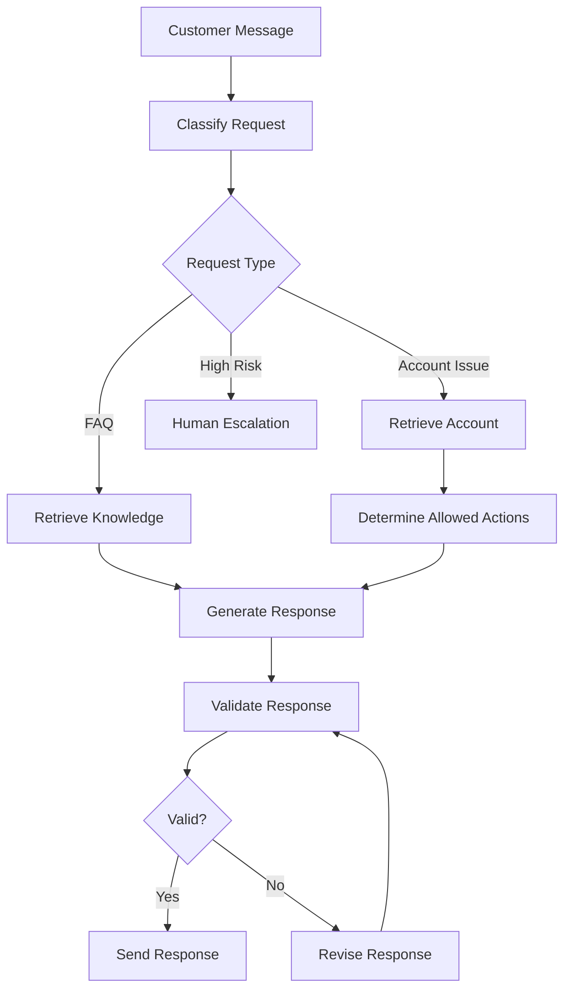
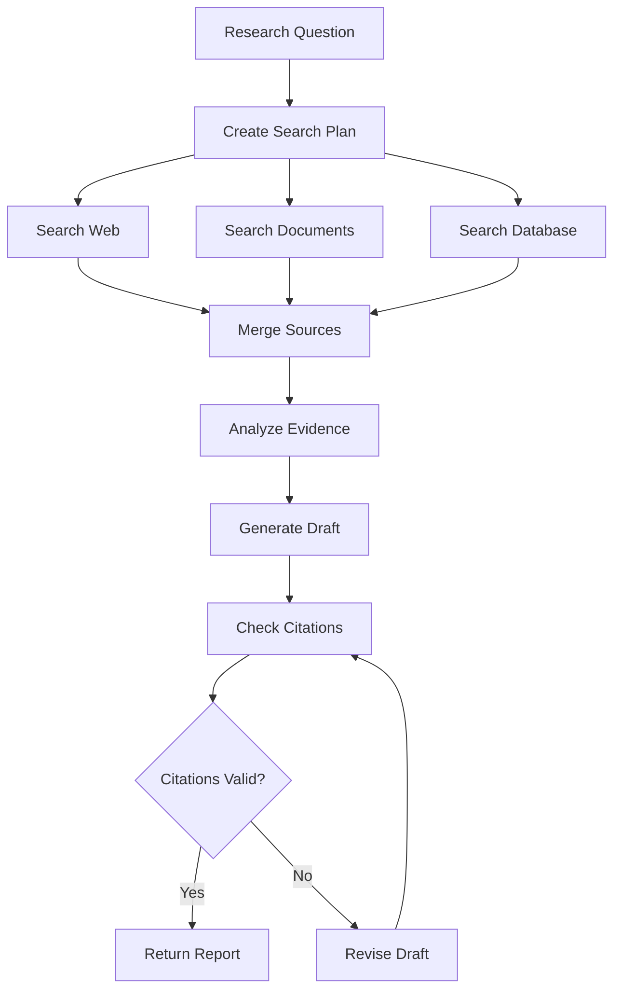

# 02. Workflows

> Workflows organize complex AI tasks into structured, testable, and maintainable sequences of steps.

---

# Introduction

AI systems often begin as a single prompt sent to a language model. This approach is useful for simple tasks, but it becomes difficult to manage as applications grow.

A production AI system may need to:

- understand a request
- retrieve information
- choose a tool
- execute an action
- validate the result
- ask for human approval
- generate a final response

Trying to perform all of these responsibilities inside one prompt creates fragile systems that are difficult to test, debug, and improve.

Workflows solve this problem by dividing a larger task into smaller stages with clear responsibilities.

This chapter explains why workflows exist, how they evolved, the major workflow patterns, their tradeoffs, and how to choose the right structure for an AI application.

---

# Why Workflows Exist

Early AI applications often relied on a single language model call to perform an entire task.

For simple requests, this can work well:

```text
User Request
     ↓
Language Model
     ↓
Response
```

However, real applications usually involve more than one responsibility.

A customer support system may need to:

1. classify the issue
2. retrieve account information
3. search documentation
4. determine whether a refund is allowed
5. draft a response
6. request approval
7. send the message

Combining all of these responsibilities into one prompt creates several problems:

- prompts become long and difficult to maintain
- failures are difficult to isolate
- tool calls become harder to control
- validation is inconsistent
- retries may repeat unnecessary work
- costs increase
- latency becomes unpredictable
- business rules become mixed with model instructions

Workflows divide the task into smaller, explicit steps.

```text
User Request
     ↓
Classify
     ↓
Retrieve Context
     ↓
Choose Action
     ↓
Execute Tool
     ↓
Validate Result
     ↓
Respond
```

Each stage can then be:

- tested independently
- monitored separately
- retried safely
- replaced without redesigning the entire system
- assigned to the most appropriate model or service

A workflow does not remove complexity. It organizes complexity into manageable components.

---

# The Problem Workflows Solve

Workflows primarily solve five engineering problems.

## 1. Responsibility Separation

A single prompt may be asked to reason, retrieve, calculate, validate, and write at the same time.

This creates conflicting objectives.

For example, a model asked to be both creative and strictly compliant may prioritize one behavior over the other.

A workflow separates these responsibilities:

```text
Retriever → Reasoner → Validator → Writer
```

Each component has a narrower and clearer goal.

## 2. Reliability

Complex prompts often fail in unpredictable ways.

Breaking a task into stages makes it easier to identify which step failed and how to recover.

## 3. Observability

A single model call provides limited visibility into intermediate decisions.

A workflow exposes:

- routing decisions
- tool inputs
- tool outputs
- validation results
- retry attempts
- human approvals

## 4. Reusability

A workflow step can often be reused in multiple applications.

Examples include:

- document retrieval
- policy validation
- sentiment classification
- response formatting
- human approval

## 5. Control

Workflows allow developers to decide which parts of a process are:

- deterministic
- model-driven
- tool-driven
- human-controlled

This is especially important in high-risk systems.

---

# Evolution of AI Workflows

AI workflows have evolved as language model capabilities and application requirements have expanded.

```text
Traditional Software
        ↓
Single Prompt
        ↓
Prompt Chains
        ↓
Tool-Augmented Workflows
        ↓
Agent Workflows
        ↓
Multi-Agent Workflows
```

## Traditional Software

Traditional software uses deterministic steps and explicit business logic.

```text
Input → Rules → Output
```

This remains the best approach when requirements are stable and fully defined.

## Single-Prompt Applications

The first generation of LLM applications often relied on one prompt and one response.

```text
Input → LLM → Output
```

This is simple, but limited.

## Prompt Chains

Prompt chains divide a task into multiple model calls.

```text
Generate Draft → Review Draft → Rewrite Draft
```

This improves specialization and makes prompts easier to manage.

## Tool-Augmented Workflows

Tool calling allows models to interact with external systems.

```text
Understand Request → Select Tool → Execute Tool → Interpret Result
```

## Agent Workflows

Agent workflows allow the system to make dynamic decisions about which steps to execute.

```text
Goal → Plan → Act → Observe → Continue or Stop
```

## Multi-Agent Workflows

Multi-agent systems divide responsibilities among specialized agents.

```text
Coordinator
├── Research Agent
├── Analysis Agent
└── Review Agent
```

Each stage of this evolution addresses limitations of the previous one. More advanced architectures are not automatically better. They should be introduced only when their benefits justify their cost and complexity.

---

# What Is a Workflow?

A workflow is a structured sequence of operations used to accomplish a goal.

A workflow may include:

- deterministic code
- language model calls
- retrieval
- routing
- tool execution
- validation
- human approval
- memory operations
- retries
- branching
- parallel execution

A workflow can be fixed or dynamic.

## Fixed Workflow

A fixed workflow follows a predefined sequence.

```text
Input → Retrieve → Generate → Validate → Output
```

The sequence is known in advance.

## Dynamic Workflow

A dynamic workflow chooses its path at runtime.

```text
Input
  ↓
Router
 ├── Billing Workflow
 ├── Technical Support Workflow
 └── Human Escalation Workflow
```

The execution path depends on the request, system state, or intermediate results.

---

# Workflow Components

Most workflows contain several common components.

## Trigger

The event that starts the workflow.

Examples:

- user message
- uploaded document
- scheduled job
- webhook
- database update
- incoming email

## Input

The data required to begin execution.

Examples:

- user request
- customer record
- document
- transaction
- support ticket

## Step

A single unit of work.

Examples:

- classify the request
- retrieve documents
- call an API
- summarize results
- validate an output

## State

Information passed between workflow steps.

State may include:

- original input
- intermediate results
- errors
- tool outputs
- retry counts
- confidence scores
- approval status

## Decision Point

A location where the workflow selects between multiple paths.

```text
Is confidence high?
├── Yes → Continue
└── No  → Human Review
```

## Output

The final result produced by the workflow.

Examples:

- response
- report
- database update
- email
- recommendation
- completed task

## Stopping Condition

The rule that determines when execution ends.

Examples:

- task completed
- maximum iterations reached
- confidence threshold met
- user approval received
- unrecoverable error detected

---

# Workflow Patterns

Different workflow patterns exist because different problems require different execution structures.

The major patterns are:

- sequential workflows
- parallel workflows
- conditional workflows
- iterative workflows
- event-driven workflows
- human-in-the-loop workflows
- hierarchical workflows
- hybrid workflows

---

# Sequential Workflows

## Why Sequential Workflows Exist

Some tasks naturally consist of ordered stages where each step depends on the output of the previous one.

Examples include:

- retrieval-augmented generation
- document processing
- data transformation
- code generation and testing
- customer support resolution

A later step cannot begin until the earlier step has produced the required information.

```text
Input
  ↓
Step 1
  ↓
Step 2
  ↓
Step 3
  ↓
Output
```

## How Sequential Workflows Work

Each stage receives the output of the previous stage.

Example:

```text
User Question
      ↓
Retrieve Documents
      ↓
Rank Documents
      ↓
Generate Answer
      ↓
Validate Citations
      ↓
Return Response
```

## Advantages

- easy to understand
- easy to debug
- predictable execution order
- clear dependency management
- straightforward state passing

## Tradeoffs

- total latency grows with each step
- one failure can block the entire process
- independent operations may be unnecessarily serialized
- long chains can become difficult to maintain

## When to Use

Use sequential workflows when:

- each step depends on the previous output
- execution order matters
- intermediate results require validation
- the task has a clear linear structure

## When Not to Use

Avoid purely sequential workflows when:

- several tasks are independent
- latency is critical
- the process requires many dynamic branches
- one central sequence becomes too large

## Example

```python
def run_workflow(question: str) -> str:
    documents = retrieve_documents(question)
    ranked_documents = rank_documents(question, documents)
    answer = generate_answer(question, ranked_documents)
    validated_answer = validate_answer(answer, ranked_documents)
    return validated_answer
```

---

# Parallel Workflows

## Why Parallel Workflows Exist

Not every task depends on previous results.

Independent tasks can execute simultaneously, reducing overall latency.

Examples include:

- querying multiple search engines
- calling several APIs
- running multiple retrieval strategies
- generating several candidate answers
- evaluating an output with multiple validators

```text
             ┌→ Task A ─┐
Input ───────┼→ Task B ─┼→ Combine Results
             └→ Task C ─┘
```

## How Parallel Workflows Work

The workflow starts multiple independent branches and waits for their results before continuing.

Example:

```text
User Request
      ↓
 ┌────┼────────┐
 ↓    ↓        ↓
Web  Database  Documents
 ↓    ↓        ↓
 └────┼────────┘
      ↓
Merge Results
```

## Advantages

- lower total latency
- improved throughput
- broader information coverage
- supports ensemble methods
- independent failures can sometimes be isolated

## Tradeoffs

- increased infrastructure requirements
- more complex synchronization
- higher peak resource usage
- merging results may be difficult
- concurrent tool limits may be reached

## When to Use

Use parallel workflows when:

- tasks are independent
- multiple sources must be queried
- latency matters
- results can be combined later

## When Not to Use

Avoid parallel execution when:

- tasks depend on one another
- tools have strict rate limits
- shared state may create conflicts
- resource usage must remain low

## Example

```python
import asyncio

async def run_parallel_workflow(query: str) -> list:
    results = await asyncio.gather(
        search_web(query),
        search_database(query),
        search_documents(query),
    )
    return merge_results(results)
```

---

# Conditional Workflows

## Why Conditional Workflows Exist

Many applications cannot follow one fixed execution path.

A billing request, password reset, sales inquiry, and technical issue should not all use the same tools and prompts.

Conditional workflows select the path that matches the current request.

```text
Input
  ↓
Decision
 ├── Path A
 ├── Path B
 └── Path C
```

This prevents unnecessary operations and allows specialized handling.

## How Conditional Workflows Work

A decision point evaluates:

- rules
- classifications
- confidence scores
- user attributes
- workflow state
- model output

Example:

```text
Support Ticket
      ↓
Classify Issue
 ┌────┼────────────┐
 ↓    ↓            ↓
Billing Technical  Account
```

## Advantages

- avoids unnecessary steps
- supports specialized logic
- improves efficiency
- reduces cost
- makes workflows more adaptive

## Tradeoffs

- routing errors send requests down the wrong path
- branch logic can become difficult to maintain
- testing requires coverage of every path
- categories may overlap

## When to Use

Use conditional workflows when:

- request types require different handling
- optional steps should run only when necessary
- risk levels vary
- confidence determines escalation

## When Not to Use

Avoid complex branching when:

- all requests use the same process
- categories are unstable
- the routing decision is less reliable than the downstream workflow

## Example

```python
def route_request(request: str) -> str:
    category = classify_request(request)

    if category == "billing":
        return run_billing_workflow(request)
    if category == "technical":
        return run_technical_workflow(request)

    return run_general_support_workflow(request)
```

---

# Iterative Workflows

## Why Iterative Workflows Exist

Some tasks benefit from repeated refinement.

A first attempt may be incomplete, inaccurate, or poorly formatted. Instead of accepting the first output, the workflow evaluates and improves it.

Examples include:

- writing
- code generation
- planning
- research
- design
- self-review

```text
Generate
   ↓
Evaluate
   ↓
Improve
   └──────→ Repeat
```

## How Iterative Workflows Work

An iterative workflow repeats one or more steps until a stopping condition is met.

Common stopping conditions include:

- quality threshold reached
- test passed
- no major issues found
- maximum iterations reached
- budget exhausted

## Advantages

- improves output quality
- supports correction
- allows feedback-driven refinement
- useful for complex tasks

## Tradeoffs

- increased latency
- higher token usage
- risk of infinite loops
- diminishing returns
- repeated outputs may drift

## When to Use

Use iterative workflows when:

- outputs can be objectively evaluated
- revision improves quality
- errors can be corrected
- the task benefits from feedback

## When Not to Use

Avoid iteration when:

- quality cannot be measured
- latency must be low
- the first response is usually sufficient
- repeated calls provide little improvement

## Example

```python
def iterative_workflow(task: str, max_iterations: int = 3) -> str:
    result = generate(task)

    for _ in range(max_iterations):
        evaluation = evaluate(result)

        if evaluation.passed:
            return result

        result = improve(result, evaluation.feedback)

    return result
```

---

# Human-in-the-Loop Workflows

## Why Human Review Exists

Some actions carry legal, financial, operational, or safety risks that should not be delegated entirely to an AI system.

Human review introduces a controlled approval point before a critical decision or action.

Examples include:

- approving a refund
- sending a legal response
- publishing content
- deploying software
- changing customer records
- executing financial transactions

```text
AI Recommendation
       ↓
Human Review
   ├── Approve → Execute
   ├── Revise  → Return
   └── Reject  → Stop
```

## Advantages

- reduces high-impact errors
- supports accountability
- improves compliance
- captures expert judgment
- provides training and evaluation data

## Tradeoffs

- slower execution
- higher operational cost
- human availability becomes a dependency
- inconsistent reviewer decisions
- approval queues may become bottlenecks

## When to Use

Use human review when:

- mistakes have serious consequences
- policy requires approval
- model confidence is low
- requests are unusual
- actions are irreversible

## When Not to Use

Avoid mandatory review for every request when:

- risk is low
- volume is high
- decisions are easily reversible
- automation is sufficiently reliable

A risk-based review strategy is usually better than reviewing every case.

---

# Event-Driven Workflows

## Why Event-Driven Workflows Exist

Some processes should begin when an external event occurs rather than when a user manually starts them.

Examples include:

- a new support ticket
- a file upload
- an incoming email
- a failed payment
- a scheduled time
- a database update

```text
Event
  ↓
Trigger
  ↓
Workflow
```

## Advantages

- supports automation
- responds quickly to system changes
- decouples workflow initiation from user interaction
- scales well for asynchronous processes

## Tradeoffs

- duplicate events may trigger repeated work
- event ordering can be difficult
- debugging distributed systems is harder
- workflows require idempotency

## When to Use

Use event-driven workflows when:

- tasks begin from external system changes
- processing can happen asynchronously
- multiple systems must coordinate
- real-time response is useful

---

# Hierarchical Workflows

## Why Hierarchical Workflows Exist

Large workflows often become difficult to manage as one flat sequence.

Hierarchical workflows divide the process into smaller sub-workflows.

```text
Main Workflow
├── Intake Workflow
├── Research Workflow
├── Review Workflow
└── Delivery Workflow
```

Each sub-workflow can be developed, tested, and monitored independently.

## Advantages

- improves modularity
- supports reuse
- reduces cognitive complexity
- simplifies ownership
- makes large systems easier to maintain

## Tradeoffs

- state must cross workflow boundaries
- failures may be harder to trace
- coordination overhead increases
- interfaces must be carefully defined

## When to Use

Use hierarchical workflows when:

- a process contains several distinct phases
- sub-processes are reusable
- different teams own different components
- a flat workflow has become too large

---

# Hybrid Workflows

## Why Hybrid Workflows Exist

Real production systems rarely use only one workflow pattern.

A system may:

1. route requests conditionally
2. run retrieval sources in parallel
3. generate a response sequentially
4. iterate if validation fails
5. request human approval for risky actions

```text
Input
  ↓
Conditional Router
  ↓
Parallel Retrieval
  ↓
Sequential Generation
  ↓
Validation Loop
  ↓
Human Review if Needed
```

Hybrid workflows combine the strengths of multiple patterns.

## Tradeoffs

Hybrid systems are powerful, but they can become difficult to understand.

Use them only when each additional pattern solves a clearly defined problem.

---

# Deterministic vs Agentic Workflows

One of the most important design decisions is determining which steps should be controlled by code and which should be controlled by a model.

## Deterministic Workflow

The execution path is defined in advance.

```text
Input → Step A → Step B → Step C
```

### Strengths

- predictable
- testable
- easier to audit
- lower risk
- easier to estimate cost

### Weaknesses

- less flexible
- requires explicit rules
- difficult to handle unusual requests

## Agentic Workflow

The model decides which actions to take.

```text
Goal → Model Chooses Action → Observe Result → Continue
```

### Strengths

- flexible
- adapts to new situations
- handles ambiguous tasks
- supports dynamic planning

### Weaknesses

- less predictable
- more expensive
- harder to test
- greater security risk
- may loop or select poor actions

## Recommended Approach

Use deterministic control where the process is known and stable.

Use agentic decision making only where flexibility provides real value.

A common production pattern is:

```text
Deterministic Workflow
        ↓
Agentic Decision Point
        ↓
Deterministic Execution
```

This gives the model limited flexibility while keeping critical actions controlled.

---

# Workflow State

Workflow state contains the information required across steps.

Example:

```python
from dataclasses import dataclass, field
from typing import Any

@dataclass
class WorkflowState:
    user_request: str
    category: str | None = None
    context: list[str] = field(default_factory=list)
    tool_results: dict[str, Any] = field(default_factory=dict)
    errors: list[str] = field(default_factory=list)
    retry_count: int = 0
    approved: bool = False
    final_response: str | None = None
```

## Why Explicit State Matters

Without explicit state, workflows often depend on hidden variables, conversation history, or loosely structured dictionaries.

Explicit state improves:

- debugging
- validation
- logging
- reproducibility
- testing
- recovery

## State Design Principles

- store only necessary information
- use clear field names
- validate values between steps
- avoid hidden state
- separate persistent state from temporary state
- redact sensitive information
- version the state schema

---

# Error Handling

Failures are normal in production workflows.

Possible failures include:

- model timeout
- invalid model output
- tool failure
- API rate limit
- missing data
- retrieval failure
- validation failure
- human rejection

A workflow should define what happens when each step fails.

```text
Step Fails
   ↓
Is Failure Retryable?
 ├── Yes → Retry with Limit
 └── No  → Fallback or Escalate
```

## Retry Strategy

Retries should be limited and targeted.

Avoid restarting the entire workflow when only one step failed.

```python
def execute_with_retry(operation, max_retries: int = 3):
    last_error = None

    for _ in range(max_retries):
        try:
            return operation()
        except TemporaryError as error:
            last_error = error

    raise WorkflowError("Operation failed after retries") from last_error
```

## Fallback Strategy

Possible fallbacks include:

- use a smaller or larger model
- use cached data
- switch tools
- use deterministic rules
- ask the user for clarification
- escalate to a human
- return a partial result

---

# Idempotency

An idempotent step can safely run more than once without creating duplicate side effects.

This is important for:

- payments
- emails
- database updates
- ticket creation
- file uploads

For example, retrying an email-generation step may be safe. Retrying the actual email-sending step may send duplicate messages.

Use unique operation identifiers to prevent duplicate actions.

```python
def send_email_once(operation_id: str, message: dict):
    if operation_already_completed(operation_id):
        return get_previous_result(operation_id)

    result = send_email(message)
    record_completed_operation(operation_id, result)
    return result
```

---

# Workflow Validation

Validation should occur at important boundaries.

Examples include:

- validating user input
- validating model-generated JSON
- checking tool arguments
- checking tool results
- verifying citations
- enforcing policy
- confirming approval

```text
Generate Output
      ↓
Validate
 ├── Valid   → Continue
 └── Invalid → Repair, Retry, or Escalate
```

Validation may be performed by:

- schemas
- deterministic rules
- unit tests
- policy engines
- secondary models
- human reviewers

Deterministic validation should be preferred whenever possible.

---

# Workflow Observability

A workflow is difficult to improve if its execution cannot be observed.

Useful workflow telemetry includes:

- workflow ID
- step name
- start and end time
- latency
- token usage
- model used
- tool used
- retry count
- status
- error type
- confidence
- approval result
- final outcome

Example event:

```json
{
  "workflow_id": "wf_123",
  "step": "retrieve_documents",
  "status": "completed",
  "latency_ms": 420,
  "documents_found": 8
}
```

Observability is covered in greater detail in `10_monitoring.md`.

---

# Workflow Testing

Each workflow step should be testable independently.

## Unit Tests

Test individual steps.

Examples:

- classifier returns an allowed category
- tool arguments match a schema
- validator rejects unsupported claims

## Integration Tests

Test connected components.

Examples:

- retrieval output reaches generation correctly
- routing selects the expected workflow
- tool failure triggers fallback

## End-to-End Tests

Test the full workflow from input to output.

## Failure Tests

Test expected failures.

Examples:

- API timeout
- empty retrieval result
- malformed model response
- human rejection
- retry limit reached

## Regression Tests

Preserve examples of previously fixed failures to prevent them from returning.

---

# Workflow Versioning

Workflows change over time.

Changes may include:

- new prompts
- different models
- added tools
- revised routing rules
- updated validation
- modified approval requirements

Each deployed workflow should have a version identifier.

```json
{
  "workflow_name": "customer_support",
  "workflow_version": "2.3.0"
}
```

Versioning supports:

- rollback
- evaluation
- debugging
- A/B testing
- auditability

---

# Workflow Tradeoff Comparison

| Workflow Pattern | Why It Exists | Main Strength | Main Tradeoff |
|---|---|---|---|
| Sequential | Ordered dependencies | Simplicity | Higher latency |
| Parallel | Independent tasks | Speed | Synchronization complexity |
| Conditional | Different request paths | Efficiency | Routing errors |
| Iterative | Repeated improvement | Higher quality | Increased cost |
| Human-in-the-loop | Risk control | Safety | Slower execution |
| Event-driven | External triggers | Automation | Distributed complexity |
| Hierarchical | Large processes | Modularity | Coordination overhead |
| Hybrid | Mixed requirements | Flexibility | Architectural complexity |

---

# Why Not Everything Should Be a Workflow

Workflows improve organization, but they also introduce complexity.

Each additional step adds:

- latency
- cost
- failure points
- logging requirements
- testing requirements
- maintenance effort

A simple request may need only one model call.

```text
User Request → Model → Response
```

Turning this into a ten-step workflow would make the application harder to operate without providing meaningful value.

Good engineering is not about maximizing the number of workflow steps. It is about selecting the simplest structure that reliably solves the problem.

---

# Workflow Anti-Patterns

## The Giant Workflow

One workflow handles every use case.

### Why It Fails

- too many branches
- unclear ownership
- difficult testing
- high change risk

### Better Approach

Split the process into smaller workflows with defined interfaces.

## Hidden State

Steps depend on information that is not explicitly passed.

### Why It Fails

- unpredictable behavior
- difficult debugging
- poor reproducibility

### Better Approach

Use a validated state object.

## Blind Retries

The workflow retries failures without determining whether they are temporary.

### Why It Fails

- increased cost
- duplicate actions
- rate-limit escalation
- longer outages

### Better Approach

Classify errors and retry only recoverable failures.

## Infinite Loops

An iterative workflow has no reliable stopping condition.

### Why It Fails

- runaway costs
- excessive latency
- repeated tool use

### Better Approach

Use iteration, time, and cost limits.

## LLM for Every Step

A language model is used even when deterministic code is sufficient.

### Why It Fails

- higher cost
- lower reliability
- slower execution

### Better Approach

Use models for ambiguity and reasoning. Use code for deterministic operations.

## Premature Parallelism

Tasks are executed concurrently before dependencies are understood.

### Why It Fails

- race conditions
- conflicting state
- wasted work

### Better Approach

Parallelize only independent operations.

## Human Review Everywhere

Every output requires approval.

### Why It Fails

- approval bottlenecks
- high operational cost
- reduced automation value

### Better Approach

Use risk-based review.

---

# Common Failure Modes

| Failure Mode | Likely Cause | Mitigation |
|---|---|---|
| Wrong execution path | Routing error | Evaluate routing separately |
| Missing context | State not passed correctly | Validate state boundaries |
| Duplicate action | Retry without idempotency | Use operation IDs |
| Excessive latency | Too many sequential steps | Parallelize independent work |
| High cost | Model used unnecessarily | Replace deterministic steps with code |
| Infinite loop | Missing stopping condition | Set iteration and budget limits |
| Silent failure | Weak monitoring | Log step-level outcomes |
| Invalid tool call | Unvalidated arguments | Enforce schemas |
| Workflow drift | Unversioned changes | Version and evaluate deployments |
| Approval bottleneck | Too much human review | Apply risk-based escalation |

---

# Choosing the Right Workflow

Use the following questions to choose a workflow pattern.

## Do Steps Depend on Previous Results?

Use a sequential workflow.

## Can Tasks Run Independently?

Use a parallel workflow.

## Do Different Inputs Require Different Paths?

Use a conditional workflow.

## Does Output Improve Through Repeated Revision?

Use an iterative workflow.

## Does the Action Carry Significant Risk?

Add human review.

## Is the Workflow Triggered by External Events?

Use an event-driven workflow.

## Has the Workflow Become Too Large?

Split it into hierarchical sub-workflows.

## Does the System Have Several Different Requirements?

Use a hybrid workflow, but keep each component justified.

---

# Workflow Design Checklist

Before implementation:

- [ ] Define the workflow goal.
- [ ] Identify inputs and outputs.
- [ ] List each required step.
- [ ] Separate deterministic and model-driven logic.
- [ ] Identify dependencies between steps.
- [ ] Identify tasks that can run in parallel.
- [ ] Define workflow state.
- [ ] Define decision points.
- [ ] Define stopping conditions.
- [ ] Define failure handling.
- [ ] Define retry limits.
- [ ] Identify side effects requiring idempotency.
- [ ] Define validation boundaries.
- [ ] Define human approval requirements.
- [ ] Define monitoring metrics.
- [ ] Define test cases.
- [ ] Assign a workflow version.

---

# Design Principles

## Start with the Simplest Workflow

Begin with the smallest number of steps that can solve the problem reliably.

## Make State Explicit

Do not depend on hidden context.

## Use Deterministic Logic Where Possible

Use models where reasoning or ambiguity requires them.

## Isolate Side Effects

Separate reasoning from actions such as sending emails or updating databases.

## Validate at Boundaries

Check data before it moves between steps or systems.

## Design for Failure

Assume that model calls, tools, and external services will eventually fail.

## Limit Autonomy

Give agentic components only the permissions and decision space they need.

## Measure Before Optimizing

Use production data to identify actual bottlenecks.

## Prefer Reusable Components

Design common workflow steps so they can support multiple use cases.

---

# Example: Customer Support Workflow



This workflow combines:

- conditional routing
- sequential processing
- retrieval
- validation
- iteration
- human escalation

---

# Example: Research Workflow



This workflow combines:

- planning
- parallel retrieval
- sequential analysis
- iterative validation

---

# Related Chapters

- `01_agents.md` — agent concepts and architecture
- `03_memory.md` — state and memory
- `04_tools.md` — external actions
- `05_routing.md` — choosing execution paths
- `07_guardrails.md` — controlling behavior
- `08_human_review.md` — approval and escalation
- `09_evaluation.md` — measuring workflow quality
- `10_monitoring.md` — production observability
- `12_multi_agent.md` — multi-agent coordination
- `14_cost_optimization.md` — controlling workflow cost
- `16_common_failures.md` — production failure patterns
- `17_agent_economics.md` — economic tradeoffs

---

# Key Takeaways

- Workflows exist because complex AI tasks are difficult to manage inside a single prompt.
- They divide tasks into smaller, testable, and observable steps.
- Different workflow patterns solve different dependency, latency, risk, and control problems.
- Sequential workflows support ordered tasks.
- Parallel workflows reduce latency for independent work.
- Conditional workflows select specialized paths.
- Iterative workflows improve outputs through feedback.
- Human review protects high-risk actions.
- Deterministic logic should control stable processes.
- Agentic logic should be used only where flexibility provides value.
- Every workflow should define state, validation, failure handling, stopping conditions, and monitoring.
- The best workflow is the simplest one that reliably satisfies the application's requirements.
