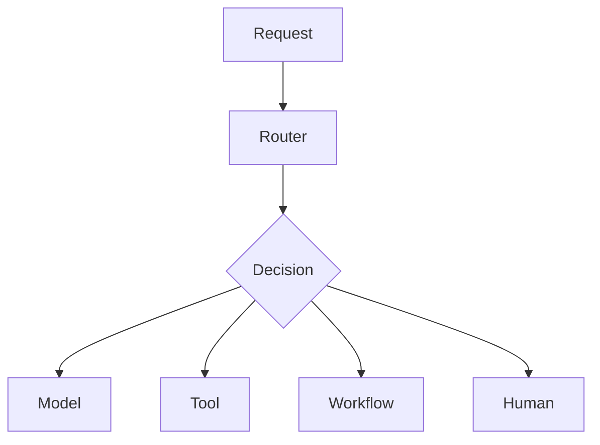

# 05. Routing
> Routing determines **what** an AI system should do next by selecting the appropriate model, tool, workflow, memory, agent, or human reviewer.

---

# Introduction

Routing is the decision-making layer of an AI system. Rather than executing work directly, it determines the best execution path based on the user's request, system state, policies, cost, latency, confidence, and available capabilities.

## Engineering Considerations

- Prefer deterministic routing where possible.
- Use model-based routing only when ambiguity justifies it.
- Record routing decisions for debugging and evaluation.
- Apply safety policies before execution.



---

# Why Routing Exists

Without routing, every request follows the same path regardless of complexity. Effective routing improves quality, cost, latency, safety, and maintainability.

## Engineering Considerations

- Prefer deterministic routing where possible.
- Use model-based routing only when ambiguity justifies it.
- Record routing decisions for debugging and evaluation.
- Apply safety policies before execution.


---

# The Problem Routing Solves

Routing answers questions such as: Which model? Which tool? Which agent? Should retrieval occur? Should a human review?

## Engineering Considerations

- Prefer deterministic routing where possible.
- Use model-based routing only when ambiguity justifies it.
- Record routing decisions for debugging and evaluation.
- Apply safety policies before execution.


---

# Evolution of Routing

Rule-based → Intent classification → Function calling → Multi-agent routing → Policy-driven autonomous routing.

## Engineering Considerations

- Prefer deterministic routing where possible.
- Use model-based routing only when ambiguity justifies it.
- Record routing decisions for debugging and evaluation.
- Apply safety policies before execution.


---

# Routing vs Workflows

Routing decides *where* work goes. Workflows define *how* work is completed after a route is chosen.

## Engineering Considerations

- Prefer deterministic routing where possible.
- Use model-based routing only when ambiguity justifies it.
- Record routing decisions for debugging and evaluation.
- Apply safety policies before execution.


---

# Types of Routing

Rule-based, model-based, hybrid, confidence-based, cost-aware, hierarchical, semantic, skill-based, and multi-agent routing.

## Engineering Considerations

- Prefer deterministic routing where possible.
- Use model-based routing only when ambiguity justifies it.
- Record routing decisions for debugging and evaluation.
- Apply safety policies before execution.


---

# Router Architecture

Input → Classification → Policy Checks → Candidate Generation → Scoring → Route Selection → Execution → Monitoring.

## Engineering Considerations

- Prefer deterministic routing where possible.
- Use model-based routing only when ambiguity justifies it.
- Record routing decisions for debugging and evaluation.
- Apply safety policies before execution.


---

# Model Routing

Choose among models based on capability, context window, latency, cost, privacy, and reasoning requirements.

## Engineering Considerations

- Prefer deterministic routing where possible.
- Use model-based routing only when ambiguity justifies it.
- Record routing decisions for debugging and evaluation.
- Apply safety policies before execution.


---

# Tool Routing

Select deterministic tools only when they add value beyond pure reasoning.

## Engineering Considerations

- Prefer deterministic routing where possible.
- Use model-based routing only when ambiguity justifies it.
- Record routing decisions for debugging and evaluation.
- Apply safety policies before execution.


---

# Memory Routing

Determine whether to retrieve, update, or ignore memory for the current request.

## Engineering Considerations

- Prefer deterministic routing where possible.
- Use model-based routing only when ambiguity justifies it.
- Record routing decisions for debugging and evaluation.
- Apply safety policies before execution.


---

# Knowledge Routing

Choose appropriate retrieval sources such as vector stores, SQL databases, APIs, or document collections.

## Engineering Considerations

- Prefer deterministic routing where possible.
- Use model-based routing only when ambiguity justifies it.
- Record routing decisions for debugging and evaluation.
- Apply safety policies before execution.


---

# Human Escalation

Escalate when confidence is low, risk is high, approval is required, or policy demands human review.

## Engineering Considerations

- Prefer deterministic routing where possible.
- Use model-based routing only when ambiguity justifies it.
- Record routing decisions for debugging and evaluation.
- Apply safety policies before execution.


---

# Confidence Thresholds

Confidence can determine whether to answer directly, retrieve more evidence, ask clarifying questions, or escalate.

## Engineering Considerations

- Prefer deterministic routing where possible.
- Use model-based routing only when ambiguity justifies it.
- Record routing decisions for debugging and evaluation.
- Apply safety policies before execution.


---

# Cost-aware Routing

Balance quality against latency and infrastructure cost. Not every request requires the largest model.

## Engineering Considerations

- Prefer deterministic routing where possible.
- Use model-based routing only when ambiguity justifies it.
- Record routing decisions for debugging and evaluation.
- Apply safety policies before execution.


---

# Fallback Routing

Define alternative execution paths for unavailable tools, failed APIs, or low-confidence outputs.

## Engineering Considerations

- Prefer deterministic routing where possible.
- Use model-based routing only when ambiguity justifies it.
- Record routing decisions for debugging and evaluation.
- Apply safety policies before execution.


---

# Routing Graphs

Complex systems frequently use DAGs or state graphs rather than simple linear flows.

## Engineering Considerations

- Prefer deterministic routing where possible.
- Use model-based routing only when ambiguity justifies it.
- Record routing decisions for debugging and evaluation.
- Apply safety policies before execution.


---

# Evaluation

Measure routing accuracy, latency, cost, success rate, escalation rate, retry rate, and user satisfaction.

## Engineering Considerations

- Prefer deterministic routing where possible.
- Use model-based routing only when ambiguity justifies it.
- Record routing decisions for debugging and evaluation.
- Apply safety policies before execution.


---

# Failure Modes

Wrong route selection, infinite routing loops, over-routing, under-routing, stale policies, confidence miscalibration, missing fallbacks.

## Engineering Considerations

- Prefer deterministic routing where possible.
- Use model-based routing only when ambiguity justifies it.
- Record routing decisions for debugging and evaluation.
- Apply safety policies before execution.


---

# Anti-patterns

God router, everything goes through one model, routing by keyword alone, routing without telemetry, routing without feedback loops.

## Engineering Considerations

- Prefer deterministic routing where possible.
- Use model-based routing only when ambiguity justifies it.
- Record routing decisions for debugging and evaluation.
- Apply safety policies before execution.


---

# Design Principles

Prefer simple rules first, separate routing from execution, make routing observable, use least-cost routes that satisfy quality, continuously evaluate routing decisions.

## Engineering Considerations

- Prefer deterministic routing where possible.
- Use model-based routing only when ambiguity justifies it.
- Record routing decisions for debugging and evaluation.
- Apply safety policies before execution.


---

# Design Checklist

Define routing goals, candidate routes, policies, scoring, fallbacks, observability, testing, and governance.

## Engineering Considerations

- Prefer deterministic routing where possible.
- Use model-based routing only when ambiguity justifies it.
- Record routing decisions for debugging and evaluation.
- Apply safety policies before execution.

```mermaid
flowchart TD
A[Request]-->B[Router]
B-->C{Decision}
C-->D[Model]
C-->E[Tool]
C-->F[Workflow]
C-->G[Human]
```

---

# Related Chapters

01_agents.md, 02_workflows.md, 03_memory.md, 04_tools.md, 06_prompts.md, 07_guardrails.md, 09_evaluation.md, 10_monitoring.md.

## Engineering Considerations

- Prefer deterministic routing where possible.
- Use model-based routing only when ambiguity justifies it.
- Record routing decisions for debugging and evaluation.
- Apply safety policies before execution.

```mermaid
flowchart TD
A[Request]-->B[Router]
B-->C{Decision}
C-->D[Model]
C-->E[Tool]
C-->F[Workflow]
C-->G[Human]
```

---

# Key Takeaways

Routing is the intelligence that connects models, tools, memory, workflows, and humans into a coherent production AI system.

## Engineering Considerations

- Prefer deterministic routing where possible.
- Use model-based routing only when ambiguity justifies it.
- Record routing decisions for debugging and evaluation.
- Apply safety policies before execution.

```mermaid
flowchart TD
A[Request]-->B[Router]
B-->C{Decision}
C-->D[Model]
C-->E[Tool]
C-->F[Workflow]
C-->G[Human]
```

## Routing Example 1

This example illustrates routing scenario 1. Evaluate intent, constraints, confidence, permissions, available tools, latency targets, and business policy before selecting an execution path. Record the decision and monitor downstream outcomes to improve future routing quality.

## Routing Example 2

This example illustrates routing scenario 2. Evaluate intent, constraints, confidence, permissions, available tools, latency targets, and business policy before selecting an execution path. Record the decision and monitor downstream outcomes to improve future routing quality.

## Routing Example 3

This example illustrates routing scenario 3. Evaluate intent, constraints, confidence, permissions, available tools, latency targets, and business policy before selecting an execution path. Record the decision and monitor downstream outcomes to improve future routing quality.

## Routing Example 4

This example illustrates routing scenario 4. Evaluate intent, constraints, confidence, permissions, available tools, latency targets, and business policy before selecting an execution path. Record the decision and monitor downstream outcomes to improve future routing quality.

## Routing Example 5

This example illustrates routing scenario 5. Evaluate intent, constraints, confidence, permissions, available tools, latency targets, and business policy before selecting an execution path. Record the decision and monitor downstream outcomes to improve future routing quality.

## Routing Example 6

This example illustrates routing scenario 6. Evaluate intent, constraints, confidence, permissions, available tools, latency targets, and business policy before selecting an execution path. Record the decision and monitor downstream outcomes to improve future routing quality.

## Routing Example 7

This example illustrates routing scenario 7. Evaluate intent, constraints, confidence, permissions, available tools, latency targets, and business policy before selecting an execution path. Record the decision and monitor downstream outcomes to improve future routing quality.

## Routing Example 8

This example illustrates routing scenario 8. Evaluate intent, constraints, confidence, permissions, available tools, latency targets, and business policy before selecting an execution path. Record the decision and monitor downstream outcomes to improve future routing quality.

## Routing Example 9

This example illustrates routing scenario 9. Evaluate intent, constraints, confidence, permissions, available tools, latency targets, and business policy before selecting an execution path. Record the decision and monitor downstream outcomes to improve future routing quality.

## Routing Example 10

This example illustrates routing scenario 10. Evaluate intent, constraints, confidence, permissions, available tools, latency targets, and business policy before selecting an execution path. Record the decision and monitor downstream outcomes to improve future routing quality.

## Routing Example 11

This example illustrates routing scenario 11. Evaluate intent, constraints, confidence, permissions, available tools, latency targets, and business policy before selecting an execution path. Record the decision and monitor downstream outcomes to improve future routing quality.

## Routing Example 12

This example illustrates routing scenario 12. Evaluate intent, constraints, confidence, permissions, available tools, latency targets, and business policy before selecting an execution path. Record the decision and monitor downstream outcomes to improve future routing quality.

## Routing Example 13

This example illustrates routing scenario 13. Evaluate intent, constraints, confidence, permissions, available tools, latency targets, and business policy before selecting an execution path. Record the decision and monitor downstream outcomes to improve future routing quality.

## Routing Example 14

This example illustrates routing scenario 14. Evaluate intent, constraints, confidence, permissions, available tools, latency targets, and business policy before selecting an execution path. Record the decision and monitor downstream outcomes to improve future routing quality.

## Routing Example 15

This example illustrates routing scenario 15. Evaluate intent, constraints, confidence, permissions, available tools, latency targets, and business policy before selecting an execution path. Record the decision and monitor downstream outcomes to improve future routing quality.

## Routing Example 16

This example illustrates routing scenario 16. Evaluate intent, constraints, confidence, permissions, available tools, latency targets, and business policy before selecting an execution path. Record the decision and monitor downstream outcomes to improve future routing quality.

## Routing Example 17

This example illustrates routing scenario 17. Evaluate intent, constraints, confidence, permissions, available tools, latency targets, and business policy before selecting an execution path. Record the decision and monitor downstream outcomes to improve future routing quality.

## Routing Example 18

This example illustrates routing scenario 18. Evaluate intent, constraints, confidence, permissions, available tools, latency targets, and business policy before selecting an execution path. Record the decision and monitor downstream outcomes to improve future routing quality.

## Routing Example 19

This example illustrates routing scenario 19. Evaluate intent, constraints, confidence, permissions, available tools, latency targets, and business policy before selecting an execution path. Record the decision and monitor downstream outcomes to improve future routing quality.

## Routing Example 20

This example illustrates routing scenario 20. Evaluate intent, constraints, confidence, permissions, available tools, latency targets, and business policy before selecting an execution path. Record the decision and monitor downstream outcomes to improve future routing quality.

## Routing Example 21

This example illustrates routing scenario 21. Evaluate intent, constraints, confidence, permissions, available tools, latency targets, and business policy before selecting an execution path. Record the decision and monitor downstream outcomes to improve future routing quality.

## Routing Example 22

This example illustrates routing scenario 22. Evaluate intent, constraints, confidence, permissions, available tools, latency targets, and business policy before selecting an execution path. Record the decision and monitor downstream outcomes to improve future routing quality.

## Routing Example 23

This example illustrates routing scenario 23. Evaluate intent, constraints, confidence, permissions, available tools, latency targets, and business policy before selecting an execution path. Record the decision and monitor downstream outcomes to improve future routing quality.

## Routing Example 24

This example illustrates routing scenario 24. Evaluate intent, constraints, confidence, permissions, available tools, latency targets, and business policy before selecting an execution path. Record the decision and monitor downstream outcomes to improve future routing quality.

## Routing Example 25

This example illustrates routing scenario 25. Evaluate intent, constraints, confidence, permissions, available tools, latency targets, and business policy before selecting an execution path. Record the decision and monitor downstream outcomes to improve future routing quality.

## Routing Example 26

This example illustrates routing scenario 26. Evaluate intent, constraints, confidence, permissions, available tools, latency targets, and business policy before selecting an execution path. Record the decision and monitor downstream outcomes to improve future routing quality.

## Routing Example 27

This example illustrates routing scenario 27. Evaluate intent, constraints, confidence, permissions, available tools, latency targets, and business policy before selecting an execution path. Record the decision and monitor downstream outcomes to improve future routing quality.

## Routing Example 28

This example illustrates routing scenario 28. Evaluate intent, constraints, confidence, permissions, available tools, latency targets, and business policy before selecting an execution path. Record the decision and monitor downstream outcomes to improve future routing quality.

## Routing Example 29

This example illustrates routing scenario 29. Evaluate intent, constraints, confidence, permissions, available tools, latency targets, and business policy before selecting an execution path. Record the decision and monitor downstream outcomes to improve future routing quality.

## Routing Example 30

This example illustrates routing scenario 30. Evaluate intent, constraints, confidence, permissions, available tools, latency targets, and business policy before selecting an execution path. Record the decision and monitor downstream outcomes to improve future routing quality.

## Routing Example 31

This example illustrates routing scenario 31. Evaluate intent, constraints, confidence, permissions, available tools, latency targets, and business policy before selecting an execution path. Record the decision and monitor downstream outcomes to improve future routing quality.

## Routing Example 32

This example illustrates routing scenario 32. Evaluate intent, constraints, confidence, permissions, available tools, latency targets, and business policy before selecting an execution path. Record the decision and monitor downstream outcomes to improve future routing quality.

## Routing Example 33

This example illustrates routing scenario 33. Evaluate intent, constraints, confidence, permissions, available tools, latency targets, and business policy before selecting an execution path. Record the decision and monitor downstream outcomes to improve future routing quality.

## Routing Example 34

This example illustrates routing scenario 34. Evaluate intent, constraints, confidence, permissions, available tools, latency targets, and business policy before selecting an execution path. Record the decision and monitor downstream outcomes to improve future routing quality.

## Routing Example 35

This example illustrates routing scenario 35. Evaluate intent, constraints, confidence, permissions, available tools, latency targets, and business policy before selecting an execution path. Record the decision and monitor downstream outcomes to improve future routing quality.

## Routing Example 36

This example illustrates routing scenario 36. Evaluate intent, constraints, confidence, permissions, available tools, latency targets, and business policy before selecting an execution path. Record the decision and monitor downstream outcomes to improve future routing quality.

## Routing Example 37

This example illustrates routing scenario 37. Evaluate intent, constraints, confidence, permissions, available tools, latency targets, and business policy before selecting an execution path. Record the decision and monitor downstream outcomes to improve future routing quality.

## Routing Example 38

This example illustrates routing scenario 38. Evaluate intent, constraints, confidence, permissions, available tools, latency targets, and business policy before selecting an execution path. Record the decision and monitor downstream outcomes to improve future routing quality.

## Routing Example 39

This example illustrates routing scenario 39. Evaluate intent, constraints, confidence, permissions, available tools, latency targets, and business policy before selecting an execution path. Record the decision and monitor downstream outcomes to improve future routing quality.

## Routing Example 40

This example illustrates routing scenario 40. Evaluate intent, constraints, confidence, permissions, available tools, latency targets, and business policy before selecting an execution path. Record the decision and monitor downstream outcomes to improve future routing quality.

## Routing Example 41

This example illustrates routing scenario 41. Evaluate intent, constraints, confidence, permissions, available tools, latency targets, and business policy before selecting an execution path. Record the decision and monitor downstream outcomes to improve future routing quality.

## Routing Example 42

This example illustrates routing scenario 42. Evaluate intent, constraints, confidence, permissions, available tools, latency targets, and business policy before selecting an execution path. Record the decision and monitor downstream outcomes to improve future routing quality.

## Routing Example 43

This example illustrates routing scenario 43. Evaluate intent, constraints, confidence, permissions, available tools, latency targets, and business policy before selecting an execution path. Record the decision and monitor downstream outcomes to improve future routing quality.

## Routing Example 44

This example illustrates routing scenario 44. Evaluate intent, constraints, confidence, permissions, available tools, latency targets, and business policy before selecting an execution path. Record the decision and monitor downstream outcomes to improve future routing quality.

## Routing Example 45

This example illustrates routing scenario 45. Evaluate intent, constraints, confidence, permissions, available tools, latency targets, and business policy before selecting an execution path. Record the decision and monitor downstream outcomes to improve future routing quality.

## Routing Example 46

This example illustrates routing scenario 46. Evaluate intent, constraints, confidence, permissions, available tools, latency targets, and business policy before selecting an execution path. Record the decision and monitor downstream outcomes to improve future routing quality.

## Routing Example 47

This example illustrates routing scenario 47. Evaluate intent, constraints, confidence, permissions, available tools, latency targets, and business policy before selecting an execution path. Record the decision and monitor downstream outcomes to improve future routing quality.

## Routing Example 48

This example illustrates routing scenario 48. Evaluate intent, constraints, confidence, permissions, available tools, latency targets, and business policy before selecting an execution path. Record the decision and monitor downstream outcomes to improve future routing quality.

## Routing Example 49

This example illustrates routing scenario 49. Evaluate intent, constraints, confidence, permissions, available tools, latency targets, and business policy before selecting an execution path. Record the decision and monitor downstream outcomes to improve future routing quality.

## Routing Example 50

This example illustrates routing scenario 50. Evaluate intent, constraints, confidence, permissions, available tools, latency targets, and business policy before selecting an execution path. Record the decision and monitor downstream outcomes to improve future routing quality.

## Routing Example 51

This example illustrates routing scenario 51. Evaluate intent, constraints, confidence, permissions, available tools, latency targets, and business policy before selecting an execution path. Record the decision and monitor downstream outcomes to improve future routing quality.

## Routing Example 52

This example illustrates routing scenario 52. Evaluate intent, constraints, confidence, permissions, available tools, latency targets, and business policy before selecting an execution path. Record the decision and monitor downstream outcomes to improve future routing quality.

## Routing Example 53

This example illustrates routing scenario 53. Evaluate intent, constraints, confidence, permissions, available tools, latency targets, and business policy before selecting an execution path. Record the decision and monitor downstream outcomes to improve future routing quality.

## Routing Example 54

This example illustrates routing scenario 54. Evaluate intent, constraints, confidence, permissions, available tools, latency targets, and business policy before selecting an execution path. Record the decision and monitor downstream outcomes to improve future routing quality.

## Routing Example 55

This example illustrates routing scenario 55. Evaluate intent, constraints, confidence, permissions, available tools, latency targets, and business policy before selecting an execution path. Record the decision and monitor downstream outcomes to improve future routing quality.

## Routing Example 56

This example illustrates routing scenario 56. Evaluate intent, constraints, confidence, permissions, available tools, latency targets, and business policy before selecting an execution path. Record the decision and monitor downstream outcomes to improve future routing quality.

## Routing Example 57

This example illustrates routing scenario 57. Evaluate intent, constraints, confidence, permissions, available tools, latency targets, and business policy before selecting an execution path. Record the decision and monitor downstream outcomes to improve future routing quality.

## Routing Example 58

This example illustrates routing scenario 58. Evaluate intent, constraints, confidence, permissions, available tools, latency targets, and business policy before selecting an execution path. Record the decision and monitor downstream outcomes to improve future routing quality.

## Routing Example 59

This example illustrates routing scenario 59. Evaluate intent, constraints, confidence, permissions, available tools, latency targets, and business policy before selecting an execution path. Record the decision and monitor downstream outcomes to improve future routing quality.

## Routing Example 60

This example illustrates routing scenario 60. Evaluate intent, constraints, confidence, permissions, available tools, latency targets, and business policy before selecting an execution path. Record the decision and monitor downstream outcomes to improve future routing quality.

## Routing Example 61

This example illustrates routing scenario 61. Evaluate intent, constraints, confidence, permissions, available tools, latency targets, and business policy before selecting an execution path. Record the decision and monitor downstream outcomes to improve future routing quality.

## Routing Example 62

This example illustrates routing scenario 62. Evaluate intent, constraints, confidence, permissions, available tools, latency targets, and business policy before selecting an execution path. Record the decision and monitor downstream outcomes to improve future routing quality.

## Routing Example 63

This example illustrates routing scenario 63. Evaluate intent, constraints, confidence, permissions, available tools, latency targets, and business policy before selecting an execution path. Record the decision and monitor downstream outcomes to improve future routing quality.

## Routing Example 64

This example illustrates routing scenario 64. Evaluate intent, constraints, confidence, permissions, available tools, latency targets, and business policy before selecting an execution path. Record the decision and monitor downstream outcomes to improve future routing quality.

## Routing Example 65

This example illustrates routing scenario 65. Evaluate intent, constraints, confidence, permissions, available tools, latency targets, and business policy before selecting an execution path. Record the decision and monitor downstream outcomes to improve future routing quality.

## Routing Example 66

This example illustrates routing scenario 66. Evaluate intent, constraints, confidence, permissions, available tools, latency targets, and business policy before selecting an execution path. Record the decision and monitor downstream outcomes to improve future routing quality.

## Routing Example 67

This example illustrates routing scenario 67. Evaluate intent, constraints, confidence, permissions, available tools, latency targets, and business policy before selecting an execution path. Record the decision and monitor downstream outcomes to improve future routing quality.

## Routing Example 68

This example illustrates routing scenario 68. Evaluate intent, constraints, confidence, permissions, available tools, latency targets, and business policy before selecting an execution path. Record the decision and monitor downstream outcomes to improve future routing quality.

## Routing Example 69

This example illustrates routing scenario 69. Evaluate intent, constraints, confidence, permissions, available tools, latency targets, and business policy before selecting an execution path. Record the decision and monitor downstream outcomes to improve future routing quality.

## Routing Example 70

This example illustrates routing scenario 70. Evaluate intent, constraints, confidence, permissions, available tools, latency targets, and business policy before selecting an execution path. Record the decision and monitor downstream outcomes to improve future routing quality.

## Routing Example 71

This example illustrates routing scenario 71. Evaluate intent, constraints, confidence, permissions, available tools, latency targets, and business policy before selecting an execution path. Record the decision and monitor downstream outcomes to improve future routing quality.

## Routing Example 72

This example illustrates routing scenario 72. Evaluate intent, constraints, confidence, permissions, available tools, latency targets, and business policy before selecting an execution path. Record the decision and monitor downstream outcomes to improve future routing quality.

## Routing Example 73

This example illustrates routing scenario 73. Evaluate intent, constraints, confidence, permissions, available tools, latency targets, and business policy before selecting an execution path. Record the decision and monitor downstream outcomes to improve future routing quality.

## Routing Example 74

This example illustrates routing scenario 74. Evaluate intent, constraints, confidence, permissions, available tools, latency targets, and business policy before selecting an execution path. Record the decision and monitor downstream outcomes to improve future routing quality.

## Routing Example 75

This example illustrates routing scenario 75. Evaluate intent, constraints, confidence, permissions, available tools, latency targets, and business policy before selecting an execution path. Record the decision and monitor downstream outcomes to improve future routing quality.

## Routing Example 76

This example illustrates routing scenario 76. Evaluate intent, constraints, confidence, permissions, available tools, latency targets, and business policy before selecting an execution path. Record the decision and monitor downstream outcomes to improve future routing quality.

## Routing Example 77

This example illustrates routing scenario 77. Evaluate intent, constraints, confidence, permissions, available tools, latency targets, and business policy before selecting an execution path. Record the decision and monitor downstream outcomes to improve future routing quality.

## Routing Example 78

This example illustrates routing scenario 78. Evaluate intent, constraints, confidence, permissions, available tools, latency targets, and business policy before selecting an execution path. Record the decision and monitor downstream outcomes to improve future routing quality.

## Routing Example 79

This example illustrates routing scenario 79. Evaluate intent, constraints, confidence, permissions, available tools, latency targets, and business policy before selecting an execution path. Record the decision and monitor downstream outcomes to improve future routing quality.

## Routing Example 80

This example illustrates routing scenario 80. Evaluate intent, constraints, confidence, permissions, available tools, latency targets, and business policy before selecting an execution path. Record the decision and monitor downstream outcomes to improve future routing quality.

