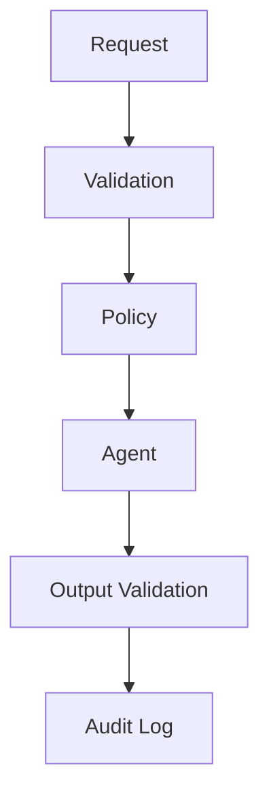

# 07. Guardrails

> Guardrails are the engineering controls that keep AI systems safe, reliable, secure, and aligned.

---

# Introduction

This section explains **introduction** within production AI systems and provides engineering guidance, trade-offs, best practices, and implementation considerations.

## Best Practices

- Prefer deterministic validation.
- Apply least privilege.
- Validate every boundary.
- Log important decisions.
- Fail safely.



---

# Why Guardrails Exist

This section explains **why guardrails exist** within production AI systems and provides engineering guidance, trade-offs, best practices, and implementation considerations.

## Best Practices

- Prefer deterministic validation.
- Apply least privilege.
- Validate every boundary.
- Log important decisions.
- Fail safely.


---

# The Problems Guardrails Solve

This section explains **the problems guardrails solve** within production AI systems and provides engineering guidance, trade-offs, best practices, and implementation considerations.

## Best Practices

- Prefer deterministic validation.
- Apply least privilege.
- Validate every boundary.
- Log important decisions.
- Fail safely.


---

# Types of Guardrails

This section explains **types of guardrails** within production AI systems and provides engineering guidance, trade-offs, best practices, and implementation considerations.

## Best Practices

- Prefer deterministic validation.
- Apply least privilege.
- Validate every boundary.
- Log important decisions.
- Fail safely.


---

# Guardrail Architecture

This section explains **guardrail architecture** within production AI systems and provides engineering guidance, trade-offs, best practices, and implementation considerations.

## Best Practices

- Prefer deterministic validation.
- Apply least privilege.
- Validate every boundary.
- Log important decisions.
- Fail safely.


---

# Input Guardrails

This section explains **input guardrails** within production AI systems and provides engineering guidance, trade-offs, best practices, and implementation considerations.

## Best Practices

- Prefer deterministic validation.
- Apply least privilege.
- Validate every boundary.
- Log important decisions.
- Fail safely.


---

# Output Guardrails

This section explains **output guardrails** within production AI systems and provides engineering guidance, trade-offs, best practices, and implementation considerations.

## Best Practices

- Prefer deterministic validation.
- Apply least privilege.
- Validate every boundary.
- Log important decisions.
- Fail safely.


---

# Tool Guardrails

This section explains **tool guardrails** within production AI systems and provides engineering guidance, trade-offs, best practices, and implementation considerations.

## Best Practices

- Prefer deterministic validation.
- Apply least privilege.
- Validate every boundary.
- Log important decisions.
- Fail safely.


---

# Memory Guardrails

This section explains **memory guardrails** within production AI systems and provides engineering guidance, trade-offs, best practices, and implementation considerations.

## Best Practices

- Prefer deterministic validation.
- Apply least privilege.
- Validate every boundary.
- Log important decisions.
- Fail safely.


---

# Model Guardrails

This section explains **model guardrails** within production AI systems and provides engineering guidance, trade-offs, best practices, and implementation considerations.

## Best Practices

- Prefer deterministic validation.
- Apply least privilege.
- Validate every boundary.
- Log important decisions.
- Fail safely.


---

# Human-in-the-Loop

This section explains **human-in-the-loop** within production AI systems and provides engineering guidance, trade-offs, best practices, and implementation considerations.

## Best Practices

- Prefer deterministic validation.
- Apply least privilege.
- Validate every boundary.
- Log important decisions.
- Fail safely.


---

# Policy Engine

This section explains **policy engine** within production AI systems and provides engineering guidance, trade-offs, best practices, and implementation considerations.

## Best Practices

- Prefer deterministic validation.
- Apply least privilege.
- Validate every boundary.
- Log important decisions.
- Fail safely.


---

# Prompt Injection Defense

This section explains **prompt injection defense** within production AI systems and provides engineering guidance, trade-offs, best practices, and implementation considerations.

## Best Practices

- Prefer deterministic validation.
- Apply least privilege.
- Validate every boundary.
- Log important decisions.
- Fail safely.


---

# Authentication and Authorization

This section explains **authentication and authorization** within production AI systems and provides engineering guidance, trade-offs, best practices, and implementation considerations.

## Best Practices

- Prefer deterministic validation.
- Apply least privilege.
- Validate every boundary.
- Log important decisions.
- Fail safely.


---

# Observability

This section explains **observability** within production AI systems and provides engineering guidance, trade-offs, best practices, and implementation considerations.

## Best Practices

- Prefer deterministic validation.
- Apply least privilege.
- Validate every boundary.
- Log important decisions.
- Fail safely.


---

# Evaluation

This section explains **evaluation** within production AI systems and provides engineering guidance, trade-offs, best practices, and implementation considerations.

## Best Practices

- Prefer deterministic validation.
- Apply least privilege.
- Validate every boundary.
- Log important decisions.
- Fail safely.


---

# Failure Modes

This section explains **failure modes** within production AI systems and provides engineering guidance, trade-offs, best practices, and implementation considerations.

## Best Practices

- Prefer deterministic validation.
- Apply least privilege.
- Validate every boundary.
- Log important decisions.
- Fail safely.


---

# Anti-Patterns

This section explains **anti-patterns** within production AI systems and provides engineering guidance, trade-offs, best practices, and implementation considerations.

## Best Practices

- Prefer deterministic validation.
- Apply least privilege.
- Validate every boundary.
- Log important decisions.
- Fail safely.


---

# Design Principles

This section explains **design principles** within production AI systems and provides engineering guidance, trade-offs, best practices, and implementation considerations.

## Best Practices

- Prefer deterministic validation.
- Apply least privilege.
- Validate every boundary.
- Log important decisions.
- Fail safely.


---

# Design Checklist

This section explains **design checklist** within production AI systems and provides engineering guidance, trade-offs, best practices, and implementation considerations.

## Best Practices

- Prefer deterministic validation.
- Apply least privilege.
- Validate every boundary.
- Log important decisions.
- Fail safely.


---

# Related Chapters

This section explains **related chapters** within production AI systems and provides engineering guidance, trade-offs, best practices, and implementation considerations.

## Best Practices

- Prefer deterministic validation.
- Apply least privilege.
- Validate every boundary.
- Log important decisions.
- Fail safely.

```mermaid
flowchart TD
A[Request]-->B[Validation]
B-->C[Policy]
C-->D[Agent]
D-->E[Output Validation]
E-->F[Audit Log]
```

---

# Key Takeaways

This section explains **key takeaways** within production AI systems and provides engineering guidance, trade-offs, best practices, and implementation considerations.

## Best Practices

- Prefer deterministic validation.
- Apply least privilege.
- Validate every boundary.
- Log important decisions.
- Fail safely.

```mermaid
flowchart TD
A[Request]-->B[Validation]
B-->C[Policy]
C-->D[Agent]
D-->E[Output Validation]
E-->F[Audit Log]
```

---

# Common Failure Modes

| Failure | Mitigation |
|---|---|
| Missing validation | Add deterministic checks |
| Prompt injection | Treat retrieved content as data |
| Unauthorized action | Enforce permissions |
| Overblocking | Tune policies |
| Hidden failures | Improve observability |


## Policy Example 1

Validate input, apply policies, verify permissions, determine whether human review is required, execute only approved actions, validate outputs, and record the complete decision for monitoring and auditing.

## Policy Example 2

Validate input, apply policies, verify permissions, determine whether human review is required, execute only approved actions, validate outputs, and record the complete decision for monitoring and auditing.

## Policy Example 3

Validate input, apply policies, verify permissions, determine whether human review is required, execute only approved actions, validate outputs, and record the complete decision for monitoring and auditing.

## Policy Example 4

Validate input, apply policies, verify permissions, determine whether human review is required, execute only approved actions, validate outputs, and record the complete decision for monitoring and auditing.

## Policy Example 5

Validate input, apply policies, verify permissions, determine whether human review is required, execute only approved actions, validate outputs, and record the complete decision for monitoring and auditing.

## Policy Example 6

Validate input, apply policies, verify permissions, determine whether human review is required, execute only approved actions, validate outputs, and record the complete decision for monitoring and auditing.

## Policy Example 7

Validate input, apply policies, verify permissions, determine whether human review is required, execute only approved actions, validate outputs, and record the complete decision for monitoring and auditing.

## Policy Example 8

Validate input, apply policies, verify permissions, determine whether human review is required, execute only approved actions, validate outputs, and record the complete decision for monitoring and auditing.

## Policy Example 9

Validate input, apply policies, verify permissions, determine whether human review is required, execute only approved actions, validate outputs, and record the complete decision for monitoring and auditing.

## Policy Example 10

Validate input, apply policies, verify permissions, determine whether human review is required, execute only approved actions, validate outputs, and record the complete decision for monitoring and auditing.

## Policy Example 11

Validate input, apply policies, verify permissions, determine whether human review is required, execute only approved actions, validate outputs, and record the complete decision for monitoring and auditing.

## Policy Example 12

Validate input, apply policies, verify permissions, determine whether human review is required, execute only approved actions, validate outputs, and record the complete decision for monitoring and auditing.

## Policy Example 13

Validate input, apply policies, verify permissions, determine whether human review is required, execute only approved actions, validate outputs, and record the complete decision for monitoring and auditing.

## Policy Example 14

Validate input, apply policies, verify permissions, determine whether human review is required, execute only approved actions, validate outputs, and record the complete decision for monitoring and auditing.

## Policy Example 15

Validate input, apply policies, verify permissions, determine whether human review is required, execute only approved actions, validate outputs, and record the complete decision for monitoring and auditing.

## Policy Example 16

Validate input, apply policies, verify permissions, determine whether human review is required, execute only approved actions, validate outputs, and record the complete decision for monitoring and auditing.

## Policy Example 17

Validate input, apply policies, verify permissions, determine whether human review is required, execute only approved actions, validate outputs, and record the complete decision for monitoring and auditing.

## Policy Example 18

Validate input, apply policies, verify permissions, determine whether human review is required, execute only approved actions, validate outputs, and record the complete decision for monitoring and auditing.

## Policy Example 19

Validate input, apply policies, verify permissions, determine whether human review is required, execute only approved actions, validate outputs, and record the complete decision for monitoring and auditing.

## Policy Example 20

Validate input, apply policies, verify permissions, determine whether human review is required, execute only approved actions, validate outputs, and record the complete decision for monitoring and auditing.

## Policy Example 21

Validate input, apply policies, verify permissions, determine whether human review is required, execute only approved actions, validate outputs, and record the complete decision for monitoring and auditing.

## Policy Example 22

Validate input, apply policies, verify permissions, determine whether human review is required, execute only approved actions, validate outputs, and record the complete decision for monitoring and auditing.

## Policy Example 23

Validate input, apply policies, verify permissions, determine whether human review is required, execute only approved actions, validate outputs, and record the complete decision for monitoring and auditing.

## Policy Example 24

Validate input, apply policies, verify permissions, determine whether human review is required, execute only approved actions, validate outputs, and record the complete decision for monitoring and auditing.

## Policy Example 25

Validate input, apply policies, verify permissions, determine whether human review is required, execute only approved actions, validate outputs, and record the complete decision for monitoring and auditing.

## Policy Example 26

Validate input, apply policies, verify permissions, determine whether human review is required, execute only approved actions, validate outputs, and record the complete decision for monitoring and auditing.

## Policy Example 27

Validate input, apply policies, verify permissions, determine whether human review is required, execute only approved actions, validate outputs, and record the complete decision for monitoring and auditing.

## Policy Example 28

Validate input, apply policies, verify permissions, determine whether human review is required, execute only approved actions, validate outputs, and record the complete decision for monitoring and auditing.

## Policy Example 29

Validate input, apply policies, verify permissions, determine whether human review is required, execute only approved actions, validate outputs, and record the complete decision for monitoring and auditing.

## Policy Example 30

Validate input, apply policies, verify permissions, determine whether human review is required, execute only approved actions, validate outputs, and record the complete decision for monitoring and auditing.

## Policy Example 31

Validate input, apply policies, verify permissions, determine whether human review is required, execute only approved actions, validate outputs, and record the complete decision for monitoring and auditing.

## Policy Example 32

Validate input, apply policies, verify permissions, determine whether human review is required, execute only approved actions, validate outputs, and record the complete decision for monitoring and auditing.

## Policy Example 33

Validate input, apply policies, verify permissions, determine whether human review is required, execute only approved actions, validate outputs, and record the complete decision for monitoring and auditing.

## Policy Example 34

Validate input, apply policies, verify permissions, determine whether human review is required, execute only approved actions, validate outputs, and record the complete decision for monitoring and auditing.

## Policy Example 35

Validate input, apply policies, verify permissions, determine whether human review is required, execute only approved actions, validate outputs, and record the complete decision for monitoring and auditing.

## Policy Example 36

Validate input, apply policies, verify permissions, determine whether human review is required, execute only approved actions, validate outputs, and record the complete decision for monitoring and auditing.

## Policy Example 37

Validate input, apply policies, verify permissions, determine whether human review is required, execute only approved actions, validate outputs, and record the complete decision for monitoring and auditing.

## Policy Example 38

Validate input, apply policies, verify permissions, determine whether human review is required, execute only approved actions, validate outputs, and record the complete decision for monitoring and auditing.

## Policy Example 39

Validate input, apply policies, verify permissions, determine whether human review is required, execute only approved actions, validate outputs, and record the complete decision for monitoring and auditing.

## Policy Example 40

Validate input, apply policies, verify permissions, determine whether human review is required, execute only approved actions, validate outputs, and record the complete decision for monitoring and auditing.

## Policy Example 41

Validate input, apply policies, verify permissions, determine whether human review is required, execute only approved actions, validate outputs, and record the complete decision for monitoring and auditing.

## Policy Example 42

Validate input, apply policies, verify permissions, determine whether human review is required, execute only approved actions, validate outputs, and record the complete decision for monitoring and auditing.

## Policy Example 43

Validate input, apply policies, verify permissions, determine whether human review is required, execute only approved actions, validate outputs, and record the complete decision for monitoring and auditing.

## Policy Example 44

Validate input, apply policies, verify permissions, determine whether human review is required, execute only approved actions, validate outputs, and record the complete decision for monitoring and auditing.

## Policy Example 45

Validate input, apply policies, verify permissions, determine whether human review is required, execute only approved actions, validate outputs, and record the complete decision for monitoring and auditing.

## Policy Example 46

Validate input, apply policies, verify permissions, determine whether human review is required, execute only approved actions, validate outputs, and record the complete decision for monitoring and auditing.

## Policy Example 47

Validate input, apply policies, verify permissions, determine whether human review is required, execute only approved actions, validate outputs, and record the complete decision for monitoring and auditing.

## Policy Example 48

Validate input, apply policies, verify permissions, determine whether human review is required, execute only approved actions, validate outputs, and record the complete decision for monitoring and auditing.

## Policy Example 49

Validate input, apply policies, verify permissions, determine whether human review is required, execute only approved actions, validate outputs, and record the complete decision for monitoring and auditing.

## Policy Example 50

Validate input, apply policies, verify permissions, determine whether human review is required, execute only approved actions, validate outputs, and record the complete decision for monitoring and auditing.

## Policy Example 51

Validate input, apply policies, verify permissions, determine whether human review is required, execute only approved actions, validate outputs, and record the complete decision for monitoring and auditing.

## Policy Example 52

Validate input, apply policies, verify permissions, determine whether human review is required, execute only approved actions, validate outputs, and record the complete decision for monitoring and auditing.

## Policy Example 53

Validate input, apply policies, verify permissions, determine whether human review is required, execute only approved actions, validate outputs, and record the complete decision for monitoring and auditing.

## Policy Example 54

Validate input, apply policies, verify permissions, determine whether human review is required, execute only approved actions, validate outputs, and record the complete decision for monitoring and auditing.

## Policy Example 55

Validate input, apply policies, verify permissions, determine whether human review is required, execute only approved actions, validate outputs, and record the complete decision for monitoring and auditing.

## Policy Example 56

Validate input, apply policies, verify permissions, determine whether human review is required, execute only approved actions, validate outputs, and record the complete decision for monitoring and auditing.

## Policy Example 57

Validate input, apply policies, verify permissions, determine whether human review is required, execute only approved actions, validate outputs, and record the complete decision for monitoring and auditing.

## Policy Example 58

Validate input, apply policies, verify permissions, determine whether human review is required, execute only approved actions, validate outputs, and record the complete decision for monitoring and auditing.

## Policy Example 59

Validate input, apply policies, verify permissions, determine whether human review is required, execute only approved actions, validate outputs, and record the complete decision for monitoring and auditing.

## Policy Example 60

Validate input, apply policies, verify permissions, determine whether human review is required, execute only approved actions, validate outputs, and record the complete decision for monitoring and auditing.

## Policy Example 61

Validate input, apply policies, verify permissions, determine whether human review is required, execute only approved actions, validate outputs, and record the complete decision for monitoring and auditing.

## Policy Example 62

Validate input, apply policies, verify permissions, determine whether human review is required, execute only approved actions, validate outputs, and record the complete decision for monitoring and auditing.

## Policy Example 63

Validate input, apply policies, verify permissions, determine whether human review is required, execute only approved actions, validate outputs, and record the complete decision for monitoring and auditing.

## Policy Example 64

Validate input, apply policies, verify permissions, determine whether human review is required, execute only approved actions, validate outputs, and record the complete decision for monitoring and auditing.

## Policy Example 65

Validate input, apply policies, verify permissions, determine whether human review is required, execute only approved actions, validate outputs, and record the complete decision for monitoring and auditing.

## Policy Example 66

Validate input, apply policies, verify permissions, determine whether human review is required, execute only approved actions, validate outputs, and record the complete decision for monitoring and auditing.

## Policy Example 67

Validate input, apply policies, verify permissions, determine whether human review is required, execute only approved actions, validate outputs, and record the complete decision for monitoring and auditing.

## Policy Example 68

Validate input, apply policies, verify permissions, determine whether human review is required, execute only approved actions, validate outputs, and record the complete decision for monitoring and auditing.

## Policy Example 69

Validate input, apply policies, verify permissions, determine whether human review is required, execute only approved actions, validate outputs, and record the complete decision for monitoring and auditing.

## Policy Example 70

Validate input, apply policies, verify permissions, determine whether human review is required, execute only approved actions, validate outputs, and record the complete decision for monitoring and auditing.

## Policy Example 71

Validate input, apply policies, verify permissions, determine whether human review is required, execute only approved actions, validate outputs, and record the complete decision for monitoring and auditing.

## Policy Example 72

Validate input, apply policies, verify permissions, determine whether human review is required, execute only approved actions, validate outputs, and record the complete decision for monitoring and auditing.

## Policy Example 73

Validate input, apply policies, verify permissions, determine whether human review is required, execute only approved actions, validate outputs, and record the complete decision for monitoring and auditing.

## Policy Example 74

Validate input, apply policies, verify permissions, determine whether human review is required, execute only approved actions, validate outputs, and record the complete decision for monitoring and auditing.

## Policy Example 75

Validate input, apply policies, verify permissions, determine whether human review is required, execute only approved actions, validate outputs, and record the complete decision for monitoring and auditing.

## Policy Example 76

Validate input, apply policies, verify permissions, determine whether human review is required, execute only approved actions, validate outputs, and record the complete decision for monitoring and auditing.

## Policy Example 77

Validate input, apply policies, verify permissions, determine whether human review is required, execute only approved actions, validate outputs, and record the complete decision for monitoring and auditing.

## Policy Example 78

Validate input, apply policies, verify permissions, determine whether human review is required, execute only approved actions, validate outputs, and record the complete decision for monitoring and auditing.

## Policy Example 79

Validate input, apply policies, verify permissions, determine whether human review is required, execute only approved actions, validate outputs, and record the complete decision for monitoring and auditing.

## Policy Example 80

Validate input, apply policies, verify permissions, determine whether human review is required, execute only approved actions, validate outputs, and record the complete decision for monitoring and auditing.
