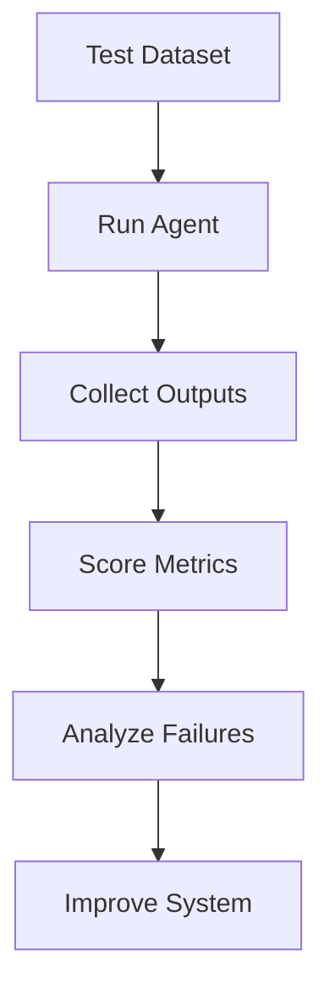

# 09. Evaluation

> Evaluation measures whether an AI system actually performs its intended task reliably, safely, efficiently, and consistently in production.

---

# Introduction

Evaluation is one of the most important disciplines in AI engineering. Building an agent is only the beginning; continuous measurement is what determines whether it is useful, trustworthy, and improving over time.

Unlike traditional software, AI systems are probabilistic. Evaluation therefore measures behavior across many examples rather than verifying a single correct output.

---

# Why Evaluation Exists

Evaluation answers questions such as:

- Does the agent solve the user's problem?
- Is it accurate?
- Is it grounded?
- Is it safe?
- Is it fast enough?
- Is it cost effective?
- Is it improving?

Without evaluation, improvements become guesswork.

---

# What Should Be Evaluated

- Answer quality
- Task completion
- Retrieval quality
- Tool selection
- Routing accuracy
- Memory usefulness
- Safety
- Hallucination rate
- Latency
- Cost
- User satisfaction

---

# Offline vs Online Evaluation

## Offline

Uses benchmark datasets and repeatable test cases.

Advantages:
- reproducible
- inexpensive
- easy comparison

## Online

Measures real production traffic.

Examples:

- A/B testing
- Shadow deployment
- Canary releases
- User feedback

---

# Evaluation Pipeline

---

# Common Metrics

| Category | Example Metrics |
|---|---|
| Quality | Accuracy, F1, BLEU, ROUGE |
| Retrieval | Recall, Precision, MRR, nDCG |
| Tools | Selection accuracy, execution success |
| Memory | Retrieval precision, usefulness |
| Routing | Correct route %, fallback rate |
| Safety | Refusal accuracy, violation rate |
| Performance | Latency, throughput |
| Cost | Tokens, API cost |
| UX | User satisfaction |

---

# Human Evaluation

Humans should evaluate:

- correctness
- completeness
- clarity
- helpfulness
- factual grounding
- tone
- policy compliance

---

# LLM-as-a-Judge

Large language models can score outputs for:

- relevance
- coherence
- completeness
- consistency

Human calibration is still required.

---

# Regression Testing

Every significant change should rerun the evaluation suite to detect regressions.

---

# A/B Testing

Compare two system versions using production traffic.

Measure:

- success rate
- latency
- cost
- user preference

---

# Failure Analysis

Investigate:

- hallucinations
- wrong tool use
- routing mistakes
- retrieval failures
- policy violations
- timeout errors

---

# Evaluation Dataset

A high-quality benchmark should contain:

- representative tasks
- expected outputs
- edge cases
- adversarial examples
- policy tests

---

# Continuous Evaluation

Production systems should evaluate continuously rather than relying only on pre-release testing.

---

# Failure Modes

| Failure | Mitigation |
|---|---|
| Measuring only accuracy | Add business metrics |
| Tiny benchmark | Increase diversity |
| Metric gaming | Use multiple metrics |
| No regression tests | Automate evaluation |
| Ignoring production | Add online monitoring |

---

# Anti-Patterns

- Evaluating only with demos
- One metric decides everything
- No baseline
- No human review
- Ignoring failures
- Optimizing benchmarks instead of users

---

# Design Principles

- Measure continuously.
- Use multiple metrics.
- Combine automated and human evaluation.
- Track cost and latency with quality.
- Evaluate complete workflows, not isolated components.

---

# Design Checklist

- [ ] Benchmark dataset
- [ ] Automated tests
- [ ] Human review
- [ ] Regression suite
- [ ] Production monitoring
- [ ] Cost tracking
- [ ] Latency tracking
- [ ] Failure analysis

---

# Related Chapters

- 04_tools.md
- 05_routing.md
- 07_guardrails.md
- 08_human_review.md
- 10_monitoring.md

---

# Key Takeaways

Evaluation transforms AI engineering from experimentation into a measurable engineering discipline.

## Evaluation Example 1

This scenario evaluates an AI workflow by measuring task success, factual accuracy, grounding, tool usage, routing quality, latency, cost, safety, and user satisfaction. Record failures, identify root causes, compare against previous baselines, and use the results to guide future improvements.

## Evaluation Example 2

This scenario evaluates an AI workflow by measuring task success, factual accuracy, grounding, tool usage, routing quality, latency, cost, safety, and user satisfaction. Record failures, identify root causes, compare against previous baselines, and use the results to guide future improvements.

## Evaluation Example 3

This scenario evaluates an AI workflow by measuring task success, factual accuracy, grounding, tool usage, routing quality, latency, cost, safety, and user satisfaction. Record failures, identify root causes, compare against previous baselines, and use the results to guide future improvements.

## Evaluation Example 4

This scenario evaluates an AI workflow by measuring task success, factual accuracy, grounding, tool usage, routing quality, latency, cost, safety, and user satisfaction. Record failures, identify root causes, compare against previous baselines, and use the results to guide future improvements.

## Evaluation Example 5

This scenario evaluates an AI workflow by measuring task success, factual accuracy, grounding, tool usage, routing quality, latency, cost, safety, and user satisfaction. Record failures, identify root causes, compare against previous baselines, and use the results to guide future improvements.

## Evaluation Example 6

This scenario evaluates an AI workflow by measuring task success, factual accuracy, grounding, tool usage, routing quality, latency, cost, safety, and user satisfaction. Record failures, identify root causes, compare against previous baselines, and use the results to guide future improvements.

## Evaluation Example 7

This scenario evaluates an AI workflow by measuring task success, factual accuracy, grounding, tool usage, routing quality, latency, cost, safety, and user satisfaction. Record failures, identify root causes, compare against previous baselines, and use the results to guide future improvements.

## Evaluation Example 8

This scenario evaluates an AI workflow by measuring task success, factual accuracy, grounding, tool usage, routing quality, latency, cost, safety, and user satisfaction. Record failures, identify root causes, compare against previous baselines, and use the results to guide future improvements.

## Evaluation Example 9

This scenario evaluates an AI workflow by measuring task success, factual accuracy, grounding, tool usage, routing quality, latency, cost, safety, and user satisfaction. Record failures, identify root causes, compare against previous baselines, and use the results to guide future improvements.

## Evaluation Example 10

This scenario evaluates an AI workflow by measuring task success, factual accuracy, grounding, tool usage, routing quality, latency, cost, safety, and user satisfaction. Record failures, identify root causes, compare against previous baselines, and use the results to guide future improvements.

## Evaluation Example 11

This scenario evaluates an AI workflow by measuring task success, factual accuracy, grounding, tool usage, routing quality, latency, cost, safety, and user satisfaction. Record failures, identify root causes, compare against previous baselines, and use the results to guide future improvements.

## Evaluation Example 12

This scenario evaluates an AI workflow by measuring task success, factual accuracy, grounding, tool usage, routing quality, latency, cost, safety, and user satisfaction. Record failures, identify root causes, compare against previous baselines, and use the results to guide future improvements.

## Evaluation Example 13

This scenario evaluates an AI workflow by measuring task success, factual accuracy, grounding, tool usage, routing quality, latency, cost, safety, and user satisfaction. Record failures, identify root causes, compare against previous baselines, and use the results to guide future improvements.

## Evaluation Example 14

This scenario evaluates an AI workflow by measuring task success, factual accuracy, grounding, tool usage, routing quality, latency, cost, safety, and user satisfaction. Record failures, identify root causes, compare against previous baselines, and use the results to guide future improvements.

## Evaluation Example 15

This scenario evaluates an AI workflow by measuring task success, factual accuracy, grounding, tool usage, routing quality, latency, cost, safety, and user satisfaction. Record failures, identify root causes, compare against previous baselines, and use the results to guide future improvements.

## Evaluation Example 16

This scenario evaluates an AI workflow by measuring task success, factual accuracy, grounding, tool usage, routing quality, latency, cost, safety, and user satisfaction. Record failures, identify root causes, compare against previous baselines, and use the results to guide future improvements.

## Evaluation Example 17

This scenario evaluates an AI workflow by measuring task success, factual accuracy, grounding, tool usage, routing quality, latency, cost, safety, and user satisfaction. Record failures, identify root causes, compare against previous baselines, and use the results to guide future improvements.

## Evaluation Example 18

This scenario evaluates an AI workflow by measuring task success, factual accuracy, grounding, tool usage, routing quality, latency, cost, safety, and user satisfaction. Record failures, identify root causes, compare against previous baselines, and use the results to guide future improvements.

## Evaluation Example 19

This scenario evaluates an AI workflow by measuring task success, factual accuracy, grounding, tool usage, routing quality, latency, cost, safety, and user satisfaction. Record failures, identify root causes, compare against previous baselines, and use the results to guide future improvements.

## Evaluation Example 20

This scenario evaluates an AI workflow by measuring task success, factual accuracy, grounding, tool usage, routing quality, latency, cost, safety, and user satisfaction. Record failures, identify root causes, compare against previous baselines, and use the results to guide future improvements.

## Evaluation Example 21

This scenario evaluates an AI workflow by measuring task success, factual accuracy, grounding, tool usage, routing quality, latency, cost, safety, and user satisfaction. Record failures, identify root causes, compare against previous baselines, and use the results to guide future improvements.

## Evaluation Example 22

This scenario evaluates an AI workflow by measuring task success, factual accuracy, grounding, tool usage, routing quality, latency, cost, safety, and user satisfaction. Record failures, identify root causes, compare against previous baselines, and use the results to guide future improvements.

## Evaluation Example 23

This scenario evaluates an AI workflow by measuring task success, factual accuracy, grounding, tool usage, routing quality, latency, cost, safety, and user satisfaction. Record failures, identify root causes, compare against previous baselines, and use the results to guide future improvements.

## Evaluation Example 24

This scenario evaluates an AI workflow by measuring task success, factual accuracy, grounding, tool usage, routing quality, latency, cost, safety, and user satisfaction. Record failures, identify root causes, compare against previous baselines, and use the results to guide future improvements.

## Evaluation Example 25

This scenario evaluates an AI workflow by measuring task success, factual accuracy, grounding, tool usage, routing quality, latency, cost, safety, and user satisfaction. Record failures, identify root causes, compare against previous baselines, and use the results to guide future improvements.

## Evaluation Example 26

This scenario evaluates an AI workflow by measuring task success, factual accuracy, grounding, tool usage, routing quality, latency, cost, safety, and user satisfaction. Record failures, identify root causes, compare against previous baselines, and use the results to guide future improvements.

## Evaluation Example 27

This scenario evaluates an AI workflow by measuring task success, factual accuracy, grounding, tool usage, routing quality, latency, cost, safety, and user satisfaction. Record failures, identify root causes, compare against previous baselines, and use the results to guide future improvements.

## Evaluation Example 28

This scenario evaluates an AI workflow by measuring task success, factual accuracy, grounding, tool usage, routing quality, latency, cost, safety, and user satisfaction. Record failures, identify root causes, compare against previous baselines, and use the results to guide future improvements.

## Evaluation Example 29

This scenario evaluates an AI workflow by measuring task success, factual accuracy, grounding, tool usage, routing quality, latency, cost, safety, and user satisfaction. Record failures, identify root causes, compare against previous baselines, and use the results to guide future improvements.

## Evaluation Example 30

This scenario evaluates an AI workflow by measuring task success, factual accuracy, grounding, tool usage, routing quality, latency, cost, safety, and user satisfaction. Record failures, identify root causes, compare against previous baselines, and use the results to guide future improvements.

## Evaluation Example 31

This scenario evaluates an AI workflow by measuring task success, factual accuracy, grounding, tool usage, routing quality, latency, cost, safety, and user satisfaction. Record failures, identify root causes, compare against previous baselines, and use the results to guide future improvements.

## Evaluation Example 32

This scenario evaluates an AI workflow by measuring task success, factual accuracy, grounding, tool usage, routing quality, latency, cost, safety, and user satisfaction. Record failures, identify root causes, compare against previous baselines, and use the results to guide future improvements.

## Evaluation Example 33

This scenario evaluates an AI workflow by measuring task success, factual accuracy, grounding, tool usage, routing quality, latency, cost, safety, and user satisfaction. Record failures, identify root causes, compare against previous baselines, and use the results to guide future improvements.

## Evaluation Example 34

This scenario evaluates an AI workflow by measuring task success, factual accuracy, grounding, tool usage, routing quality, latency, cost, safety, and user satisfaction. Record failures, identify root causes, compare against previous baselines, and use the results to guide future improvements.

## Evaluation Example 35

This scenario evaluates an AI workflow by measuring task success, factual accuracy, grounding, tool usage, routing quality, latency, cost, safety, and user satisfaction. Record failures, identify root causes, compare against previous baselines, and use the results to guide future improvements.

## Evaluation Example 36

This scenario evaluates an AI workflow by measuring task success, factual accuracy, grounding, tool usage, routing quality, latency, cost, safety, and user satisfaction. Record failures, identify root causes, compare against previous baselines, and use the results to guide future improvements.

## Evaluation Example 37

This scenario evaluates an AI workflow by measuring task success, factual accuracy, grounding, tool usage, routing quality, latency, cost, safety, and user satisfaction. Record failures, identify root causes, compare against previous baselines, and use the results to guide future improvements.

## Evaluation Example 38

This scenario evaluates an AI workflow by measuring task success, factual accuracy, grounding, tool usage, routing quality, latency, cost, safety, and user satisfaction. Record failures, identify root causes, compare against previous baselines, and use the results to guide future improvements.

## Evaluation Example 39

This scenario evaluates an AI workflow by measuring task success, factual accuracy, grounding, tool usage, routing quality, latency, cost, safety, and user satisfaction. Record failures, identify root causes, compare against previous baselines, and use the results to guide future improvements.

## Evaluation Example 40

This scenario evaluates an AI workflow by measuring task success, factual accuracy, grounding, tool usage, routing quality, latency, cost, safety, and user satisfaction. Record failures, identify root causes, compare against previous baselines, and use the results to guide future improvements.

## Evaluation Example 41

This scenario evaluates an AI workflow by measuring task success, factual accuracy, grounding, tool usage, routing quality, latency, cost, safety, and user satisfaction. Record failures, identify root causes, compare against previous baselines, and use the results to guide future improvements.

## Evaluation Example 42

This scenario evaluates an AI workflow by measuring task success, factual accuracy, grounding, tool usage, routing quality, latency, cost, safety, and user satisfaction. Record failures, identify root causes, compare against previous baselines, and use the results to guide future improvements.

## Evaluation Example 43

This scenario evaluates an AI workflow by measuring task success, factual accuracy, grounding, tool usage, routing quality, latency, cost, safety, and user satisfaction. Record failures, identify root causes, compare against previous baselines, and use the results to guide future improvements.

## Evaluation Example 44

This scenario evaluates an AI workflow by measuring task success, factual accuracy, grounding, tool usage, routing quality, latency, cost, safety, and user satisfaction. Record failures, identify root causes, compare against previous baselines, and use the results to guide future improvements.

## Evaluation Example 45

This scenario evaluates an AI workflow by measuring task success, factual accuracy, grounding, tool usage, routing quality, latency, cost, safety, and user satisfaction. Record failures, identify root causes, compare against previous baselines, and use the results to guide future improvements.

## Evaluation Example 46

This scenario evaluates an AI workflow by measuring task success, factual accuracy, grounding, tool usage, routing quality, latency, cost, safety, and user satisfaction. Record failures, identify root causes, compare against previous baselines, and use the results to guide future improvements.

## Evaluation Example 47

This scenario evaluates an AI workflow by measuring task success, factual accuracy, grounding, tool usage, routing quality, latency, cost, safety, and user satisfaction. Record failures, identify root causes, compare against previous baselines, and use the results to guide future improvements.

## Evaluation Example 48

This scenario evaluates an AI workflow by measuring task success, factual accuracy, grounding, tool usage, routing quality, latency, cost, safety, and user satisfaction. Record failures, identify root causes, compare against previous baselines, and use the results to guide future improvements.

## Evaluation Example 49

This scenario evaluates an AI workflow by measuring task success, factual accuracy, grounding, tool usage, routing quality, latency, cost, safety, and user satisfaction. Record failures, identify root causes, compare against previous baselines, and use the results to guide future improvements.

## Evaluation Example 50

This scenario evaluates an AI workflow by measuring task success, factual accuracy, grounding, tool usage, routing quality, latency, cost, safety, and user satisfaction. Record failures, identify root causes, compare against previous baselines, and use the results to guide future improvements.

## Evaluation Example 51

This scenario evaluates an AI workflow by measuring task success, factual accuracy, grounding, tool usage, routing quality, latency, cost, safety, and user satisfaction. Record failures, identify root causes, compare against previous baselines, and use the results to guide future improvements.

## Evaluation Example 52

This scenario evaluates an AI workflow by measuring task success, factual accuracy, grounding, tool usage, routing quality, latency, cost, safety, and user satisfaction. Record failures, identify root causes, compare against previous baselines, and use the results to guide future improvements.

## Evaluation Example 53

This scenario evaluates an AI workflow by measuring task success, factual accuracy, grounding, tool usage, routing quality, latency, cost, safety, and user satisfaction. Record failures, identify root causes, compare against previous baselines, and use the results to guide future improvements.

## Evaluation Example 54

This scenario evaluates an AI workflow by measuring task success, factual accuracy, grounding, tool usage, routing quality, latency, cost, safety, and user satisfaction. Record failures, identify root causes, compare against previous baselines, and use the results to guide future improvements.

## Evaluation Example 55

This scenario evaluates an AI workflow by measuring task success, factual accuracy, grounding, tool usage, routing quality, latency, cost, safety, and user satisfaction. Record failures, identify root causes, compare against previous baselines, and use the results to guide future improvements.

## Evaluation Example 56

This scenario evaluates an AI workflow by measuring task success, factual accuracy, grounding, tool usage, routing quality, latency, cost, safety, and user satisfaction. Record failures, identify root causes, compare against previous baselines, and use the results to guide future improvements.

## Evaluation Example 57

This scenario evaluates an AI workflow by measuring task success, factual accuracy, grounding, tool usage, routing quality, latency, cost, safety, and user satisfaction. Record failures, identify root causes, compare against previous baselines, and use the results to guide future improvements.

## Evaluation Example 58

This scenario evaluates an AI workflow by measuring task success, factual accuracy, grounding, tool usage, routing quality, latency, cost, safety, and user satisfaction. Record failures, identify root causes, compare against previous baselines, and use the results to guide future improvements.

## Evaluation Example 59

This scenario evaluates an AI workflow by measuring task success, factual accuracy, grounding, tool usage, routing quality, latency, cost, safety, and user satisfaction. Record failures, identify root causes, compare against previous baselines, and use the results to guide future improvements.

## Evaluation Example 60

This scenario evaluates an AI workflow by measuring task success, factual accuracy, grounding, tool usage, routing quality, latency, cost, safety, and user satisfaction. Record failures, identify root causes, compare against previous baselines, and use the results to guide future improvements.

## Evaluation Example 61

This scenario evaluates an AI workflow by measuring task success, factual accuracy, grounding, tool usage, routing quality, latency, cost, safety, and user satisfaction. Record failures, identify root causes, compare against previous baselines, and use the results to guide future improvements.

## Evaluation Example 62

This scenario evaluates an AI workflow by measuring task success, factual accuracy, grounding, tool usage, routing quality, latency, cost, safety, and user satisfaction. Record failures, identify root causes, compare against previous baselines, and use the results to guide future improvements.

## Evaluation Example 63

This scenario evaluates an AI workflow by measuring task success, factual accuracy, grounding, tool usage, routing quality, latency, cost, safety, and user satisfaction. Record failures, identify root causes, compare against previous baselines, and use the results to guide future improvements.

## Evaluation Example 64

This scenario evaluates an AI workflow by measuring task success, factual accuracy, grounding, tool usage, routing quality, latency, cost, safety, and user satisfaction. Record failures, identify root causes, compare against previous baselines, and use the results to guide future improvements.

## Evaluation Example 65

This scenario evaluates an AI workflow by measuring task success, factual accuracy, grounding, tool usage, routing quality, latency, cost, safety, and user satisfaction. Record failures, identify root causes, compare against previous baselines, and use the results to guide future improvements.

## Evaluation Example 66

This scenario evaluates an AI workflow by measuring task success, factual accuracy, grounding, tool usage, routing quality, latency, cost, safety, and user satisfaction. Record failures, identify root causes, compare against previous baselines, and use the results to guide future improvements.

## Evaluation Example 67

This scenario evaluates an AI workflow by measuring task success, factual accuracy, grounding, tool usage, routing quality, latency, cost, safety, and user satisfaction. Record failures, identify root causes, compare against previous baselines, and use the results to guide future improvements.

## Evaluation Example 68

This scenario evaluates an AI workflow by measuring task success, factual accuracy, grounding, tool usage, routing quality, latency, cost, safety, and user satisfaction. Record failures, identify root causes, compare against previous baselines, and use the results to guide future improvements.

## Evaluation Example 69

This scenario evaluates an AI workflow by measuring task success, factual accuracy, grounding, tool usage, routing quality, latency, cost, safety, and user satisfaction. Record failures, identify root causes, compare against previous baselines, and use the results to guide future improvements.

## Evaluation Example 70

This scenario evaluates an AI workflow by measuring task success, factual accuracy, grounding, tool usage, routing quality, latency, cost, safety, and user satisfaction. Record failures, identify root causes, compare against previous baselines, and use the results to guide future improvements.

## Evaluation Example 71

This scenario evaluates an AI workflow by measuring task success, factual accuracy, grounding, tool usage, routing quality, latency, cost, safety, and user satisfaction. Record failures, identify root causes, compare against previous baselines, and use the results to guide future improvements.

## Evaluation Example 72

This scenario evaluates an AI workflow by measuring task success, factual accuracy, grounding, tool usage, routing quality, latency, cost, safety, and user satisfaction. Record failures, identify root causes, compare against previous baselines, and use the results to guide future improvements.

## Evaluation Example 73

This scenario evaluates an AI workflow by measuring task success, factual accuracy, grounding, tool usage, routing quality, latency, cost, safety, and user satisfaction. Record failures, identify root causes, compare against previous baselines, and use the results to guide future improvements.

## Evaluation Example 74

This scenario evaluates an AI workflow by measuring task success, factual accuracy, grounding, tool usage, routing quality, latency, cost, safety, and user satisfaction. Record failures, identify root causes, compare against previous baselines, and use the results to guide future improvements.

## Evaluation Example 75

This scenario evaluates an AI workflow by measuring task success, factual accuracy, grounding, tool usage, routing quality, latency, cost, safety, and user satisfaction. Record failures, identify root causes, compare against previous baselines, and use the results to guide future improvements.

## Evaluation Example 76

This scenario evaluates an AI workflow by measuring task success, factual accuracy, grounding, tool usage, routing quality, latency, cost, safety, and user satisfaction. Record failures, identify root causes, compare against previous baselines, and use the results to guide future improvements.

## Evaluation Example 77

This scenario evaluates an AI workflow by measuring task success, factual accuracy, grounding, tool usage, routing quality, latency, cost, safety, and user satisfaction. Record failures, identify root causes, compare against previous baselines, and use the results to guide future improvements.

## Evaluation Example 78

This scenario evaluates an AI workflow by measuring task success, factual accuracy, grounding, tool usage, routing quality, latency, cost, safety, and user satisfaction. Record failures, identify root causes, compare against previous baselines, and use the results to guide future improvements.

## Evaluation Example 79

This scenario evaluates an AI workflow by measuring task success, factual accuracy, grounding, tool usage, routing quality, latency, cost, safety, and user satisfaction. Record failures, identify root causes, compare against previous baselines, and use the results to guide future improvements.

## Evaluation Example 80

This scenario evaluates an AI workflow by measuring task success, factual accuracy, grounding, tool usage, routing quality, latency, cost, safety, and user satisfaction. Record failures, identify root causes, compare against previous baselines, and use the results to guide future improvements.

## Evaluation Example 81

This scenario evaluates an AI workflow by measuring task success, factual accuracy, grounding, tool usage, routing quality, latency, cost, safety, and user satisfaction. Record failures, identify root causes, compare against previous baselines, and use the results to guide future improvements.

## Evaluation Example 82

This scenario evaluates an AI workflow by measuring task success, factual accuracy, grounding, tool usage, routing quality, latency, cost, safety, and user satisfaction. Record failures, identify root causes, compare against previous baselines, and use the results to guide future improvements.

## Evaluation Example 83

This scenario evaluates an AI workflow by measuring task success, factual accuracy, grounding, tool usage, routing quality, latency, cost, safety, and user satisfaction. Record failures, identify root causes, compare against previous baselines, and use the results to guide future improvements.

## Evaluation Example 84

This scenario evaluates an AI workflow by measuring task success, factual accuracy, grounding, tool usage, routing quality, latency, cost, safety, and user satisfaction. Record failures, identify root causes, compare against previous baselines, and use the results to guide future improvements.

## Evaluation Example 85

This scenario evaluates an AI workflow by measuring task success, factual accuracy, grounding, tool usage, routing quality, latency, cost, safety, and user satisfaction. Record failures, identify root causes, compare against previous baselines, and use the results to guide future improvements.

## Evaluation Example 86

This scenario evaluates an AI workflow by measuring task success, factual accuracy, grounding, tool usage, routing quality, latency, cost, safety, and user satisfaction. Record failures, identify root causes, compare against previous baselines, and use the results to guide future improvements.

## Evaluation Example 87

This scenario evaluates an AI workflow by measuring task success, factual accuracy, grounding, tool usage, routing quality, latency, cost, safety, and user satisfaction. Record failures, identify root causes, compare against previous baselines, and use the results to guide future improvements.

## Evaluation Example 88

This scenario evaluates an AI workflow by measuring task success, factual accuracy, grounding, tool usage, routing quality, latency, cost, safety, and user satisfaction. Record failures, identify root causes, compare against previous baselines, and use the results to guide future improvements.

## Evaluation Example 89

This scenario evaluates an AI workflow by measuring task success, factual accuracy, grounding, tool usage, routing quality, latency, cost, safety, and user satisfaction. Record failures, identify root causes, compare against previous baselines, and use the results to guide future improvements.

## Evaluation Example 90

This scenario evaluates an AI workflow by measuring task success, factual accuracy, grounding, tool usage, routing quality, latency, cost, safety, and user satisfaction. Record failures, identify root causes, compare against previous baselines, and use the results to guide future improvements.

## Evaluation Example 91

This scenario evaluates an AI workflow by measuring task success, factual accuracy, grounding, tool usage, routing quality, latency, cost, safety, and user satisfaction. Record failures, identify root causes, compare against previous baselines, and use the results to guide future improvements.

## Evaluation Example 92

This scenario evaluates an AI workflow by measuring task success, factual accuracy, grounding, tool usage, routing quality, latency, cost, safety, and user satisfaction. Record failures, identify root causes, compare against previous baselines, and use the results to guide future improvements.

## Evaluation Example 93

This scenario evaluates an AI workflow by measuring task success, factual accuracy, grounding, tool usage, routing quality, latency, cost, safety, and user satisfaction. Record failures, identify root causes, compare against previous baselines, and use the results to guide future improvements.

## Evaluation Example 94

This scenario evaluates an AI workflow by measuring task success, factual accuracy, grounding, tool usage, routing quality, latency, cost, safety, and user satisfaction. Record failures, identify root causes, compare against previous baselines, and use the results to guide future improvements.

## Evaluation Example 95

This scenario evaluates an AI workflow by measuring task success, factual accuracy, grounding, tool usage, routing quality, latency, cost, safety, and user satisfaction. Record failures, identify root causes, compare against previous baselines, and use the results to guide future improvements.

## Evaluation Example 96

This scenario evaluates an AI workflow by measuring task success, factual accuracy, grounding, tool usage, routing quality, latency, cost, safety, and user satisfaction. Record failures, identify root causes, compare against previous baselines, and use the results to guide future improvements.

## Evaluation Example 97

This scenario evaluates an AI workflow by measuring task success, factual accuracy, grounding, tool usage, routing quality, latency, cost, safety, and user satisfaction. Record failures, identify root causes, compare against previous baselines, and use the results to guide future improvements.

## Evaluation Example 98

This scenario evaluates an AI workflow by measuring task success, factual accuracy, grounding, tool usage, routing quality, latency, cost, safety, and user satisfaction. Record failures, identify root causes, compare against previous baselines, and use the results to guide future improvements.

## Evaluation Example 99

This scenario evaluates an AI workflow by measuring task success, factual accuracy, grounding, tool usage, routing quality, latency, cost, safety, and user satisfaction. Record failures, identify root causes, compare against previous baselines, and use the results to guide future improvements.

## Evaluation Example 100

This scenario evaluates an AI workflow by measuring task success, factual accuracy, grounding, tool usage, routing quality, latency, cost, safety, and user satisfaction. Record failures, identify root causes, compare against previous baselines, and use the results to guide future improvements.
