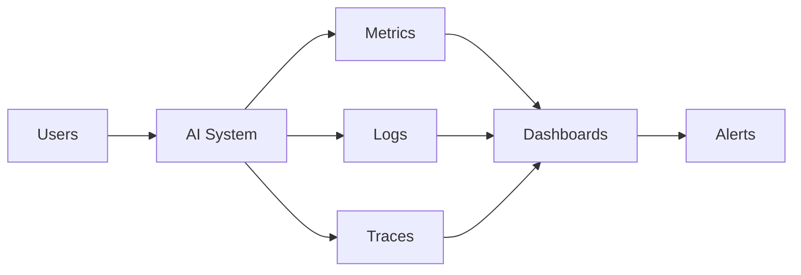

# 10. Monitoring

> Monitoring is the continuous observation of an AI system in production to ensure it remains reliable, safe, performant, and cost-effective.

---

# Introduction

Unlike traditional software, AI systems can degrade over time due to changing data, user behavior, model updates, or external dependencies. Monitoring provides visibility into system health and enables rapid detection of issues.

---

# Why Monitoring Exists

Monitoring helps answer questions such as:

- Is the system healthy?
- Are users succeeding?
- Are costs increasing?
- Are models drifting?
- Are tools failing?
- Are guardrails being triggered?
- Are SLAs being met?

---

# What Should Be Monitored

- Availability
- Latency
- Throughput
- Error rate
- Token usage
- API costs
- Retrieval quality
- Tool success rate
- Routing decisions
- Memory usage
- Hallucination indicators
- User satisfaction
- Human escalation rate

---

# Monitoring Architecture

---

# The Three Pillars

## Metrics
Numerical time-series measurements such as latency, cost, and request volume.

## Logs
Structured event records for debugging and auditing.

## Traces
End-to-end request flows across models, tools, agents, and services.

---

# Key Metrics

| Category | Example Metrics |
|---|---|
| Reliability | Uptime, availability, error rate |
| Performance | P50/P95/P99 latency, throughput |
| Cost | Tokens, API cost, cost per request |
| Quality | Success rate, hallucination rate |
| Retrieval | Recall, hit rate |
| Routing | Correct route %, fallback rate |
| Tools | Execution success, timeout rate |
| Safety | Policy violations, guardrail triggers |

---

# Alerting

Alerts should be actionable.

Examples:

- Error rate exceeds threshold
- Latency spikes
- API unavailable
- Tool failure increases
- Costs exceed budget
- Hallucination rate rises

---

# Dashboards

A production dashboard should include:

- Request volume
- Success rate
- Latency
- Cost
- Tool usage
- Model usage
- Escalations
- Active incidents

---

# Incident Response

1. Detect
2. Triage
3. Mitigate
4. Root cause analysis
5. Recovery
6. Postmortem

---

# Drift Monitoring

Track:

- input drift
- output drift
- embedding drift
- user behavior drift
- model performance drift

---

# Failure Modes

| Failure | Mitigation |
|---|---|
| Missing metrics | Instrument every service |
| Alert fatigue | Tune thresholds |
| Silent failures | Synthetic monitoring |
| No tracing | Distributed tracing |
| No ownership | Define on-call responsibilities |

---

# Anti-Patterns

- Monitoring only infrastructure
- No business metrics
- Too many alerts
- Unstructured logs
- Ignoring costs
- No postmortems

---

# Design Principles

- Monitor continuously.
- Prefer structured telemetry.
- Alert on user impact.
- Correlate metrics, logs, and traces.
- Measure business outcomes alongside technical metrics.

---

# Design Checklist

- [ ] Metrics
- [ ] Logs
- [ ] Traces
- [ ] Dashboards
- [ ] Alerts
- [ ] Incident runbooks
- [ ] Cost monitoring
- [ ] Drift detection
- [ ] Postmortem process

---

# Related Chapters

- 04_tools.md
- 05_routing.md
- 07_guardrails.md
- 09_evaluation.md

---

# Key Takeaways

Monitoring closes the feedback loop between development and production by providing continuous visibility into reliability, quality, safety, and business performance.

## Monitoring Scenario 1

Track request latency, model selection, routing decisions, retrieval quality, tool execution, token usage, API cost, guardrail events, user satisfaction, and incident signals. Compare against historical baselines, trigger alerts when thresholds are exceeded, and feed findings into evaluation and system improvements.

## Monitoring Scenario 2

Track request latency, model selection, routing decisions, retrieval quality, tool execution, token usage, API cost, guardrail events, user satisfaction, and incident signals. Compare against historical baselines, trigger alerts when thresholds are exceeded, and feed findings into evaluation and system improvements.

## Monitoring Scenario 3

Track request latency, model selection, routing decisions, retrieval quality, tool execution, token usage, API cost, guardrail events, user satisfaction, and incident signals. Compare against historical baselines, trigger alerts when thresholds are exceeded, and feed findings into evaluation and system improvements.

## Monitoring Scenario 4

Track request latency, model selection, routing decisions, retrieval quality, tool execution, token usage, API cost, guardrail events, user satisfaction, and incident signals. Compare against historical baselines, trigger alerts when thresholds are exceeded, and feed findings into evaluation and system improvements.

## Monitoring Scenario 5

Track request latency, model selection, routing decisions, retrieval quality, tool execution, token usage, API cost, guardrail events, user satisfaction, and incident signals. Compare against historical baselines, trigger alerts when thresholds are exceeded, and feed findings into evaluation and system improvements.

## Monitoring Scenario 6

Track request latency, model selection, routing decisions, retrieval quality, tool execution, token usage, API cost, guardrail events, user satisfaction, and incident signals. Compare against historical baselines, trigger alerts when thresholds are exceeded, and feed findings into evaluation and system improvements.

## Monitoring Scenario 7

Track request latency, model selection, routing decisions, retrieval quality, tool execution, token usage, API cost, guardrail events, user satisfaction, and incident signals. Compare against historical baselines, trigger alerts when thresholds are exceeded, and feed findings into evaluation and system improvements.

## Monitoring Scenario 8

Track request latency, model selection, routing decisions, retrieval quality, tool execution, token usage, API cost, guardrail events, user satisfaction, and incident signals. Compare against historical baselines, trigger alerts when thresholds are exceeded, and feed findings into evaluation and system improvements.

## Monitoring Scenario 9

Track request latency, model selection, routing decisions, retrieval quality, tool execution, token usage, API cost, guardrail events, user satisfaction, and incident signals. Compare against historical baselines, trigger alerts when thresholds are exceeded, and feed findings into evaluation and system improvements.

## Monitoring Scenario 10

Track request latency, model selection, routing decisions, retrieval quality, tool execution, token usage, API cost, guardrail events, user satisfaction, and incident signals. Compare against historical baselines, trigger alerts when thresholds are exceeded, and feed findings into evaluation and system improvements.

## Monitoring Scenario 11

Track request latency, model selection, routing decisions, retrieval quality, tool execution, token usage, API cost, guardrail events, user satisfaction, and incident signals. Compare against historical baselines, trigger alerts when thresholds are exceeded, and feed findings into evaluation and system improvements.

## Monitoring Scenario 12

Track request latency, model selection, routing decisions, retrieval quality, tool execution, token usage, API cost, guardrail events, user satisfaction, and incident signals. Compare against historical baselines, trigger alerts when thresholds are exceeded, and feed findings into evaluation and system improvements.

## Monitoring Scenario 13

Track request latency, model selection, routing decisions, retrieval quality, tool execution, token usage, API cost, guardrail events, user satisfaction, and incident signals. Compare against historical baselines, trigger alerts when thresholds are exceeded, and feed findings into evaluation and system improvements.

## Monitoring Scenario 14

Track request latency, model selection, routing decisions, retrieval quality, tool execution, token usage, API cost, guardrail events, user satisfaction, and incident signals. Compare against historical baselines, trigger alerts when thresholds are exceeded, and feed findings into evaluation and system improvements.

## Monitoring Scenario 15

Track request latency, model selection, routing decisions, retrieval quality, tool execution, token usage, API cost, guardrail events, user satisfaction, and incident signals. Compare against historical baselines, trigger alerts when thresholds are exceeded, and feed findings into evaluation and system improvements.

## Monitoring Scenario 16

Track request latency, model selection, routing decisions, retrieval quality, tool execution, token usage, API cost, guardrail events, user satisfaction, and incident signals. Compare against historical baselines, trigger alerts when thresholds are exceeded, and feed findings into evaluation and system improvements.

## Monitoring Scenario 17

Track request latency, model selection, routing decisions, retrieval quality, tool execution, token usage, API cost, guardrail events, user satisfaction, and incident signals. Compare against historical baselines, trigger alerts when thresholds are exceeded, and feed findings into evaluation and system improvements.

## Monitoring Scenario 18

Track request latency, model selection, routing decisions, retrieval quality, tool execution, token usage, API cost, guardrail events, user satisfaction, and incident signals. Compare against historical baselines, trigger alerts when thresholds are exceeded, and feed findings into evaluation and system improvements.

## Monitoring Scenario 19

Track request latency, model selection, routing decisions, retrieval quality, tool execution, token usage, API cost, guardrail events, user satisfaction, and incident signals. Compare against historical baselines, trigger alerts when thresholds are exceeded, and feed findings into evaluation and system improvements.

## Monitoring Scenario 20

Track request latency, model selection, routing decisions, retrieval quality, tool execution, token usage, API cost, guardrail events, user satisfaction, and incident signals. Compare against historical baselines, trigger alerts when thresholds are exceeded, and feed findings into evaluation and system improvements.

## Monitoring Scenario 21

Track request latency, model selection, routing decisions, retrieval quality, tool execution, token usage, API cost, guardrail events, user satisfaction, and incident signals. Compare against historical baselines, trigger alerts when thresholds are exceeded, and feed findings into evaluation and system improvements.

## Monitoring Scenario 22

Track request latency, model selection, routing decisions, retrieval quality, tool execution, token usage, API cost, guardrail events, user satisfaction, and incident signals. Compare against historical baselines, trigger alerts when thresholds are exceeded, and feed findings into evaluation and system improvements.

## Monitoring Scenario 23

Track request latency, model selection, routing decisions, retrieval quality, tool execution, token usage, API cost, guardrail events, user satisfaction, and incident signals. Compare against historical baselines, trigger alerts when thresholds are exceeded, and feed findings into evaluation and system improvements.

## Monitoring Scenario 24

Track request latency, model selection, routing decisions, retrieval quality, tool execution, token usage, API cost, guardrail events, user satisfaction, and incident signals. Compare against historical baselines, trigger alerts when thresholds are exceeded, and feed findings into evaluation and system improvements.

## Monitoring Scenario 25

Track request latency, model selection, routing decisions, retrieval quality, tool execution, token usage, API cost, guardrail events, user satisfaction, and incident signals. Compare against historical baselines, trigger alerts when thresholds are exceeded, and feed findings into evaluation and system improvements.

## Monitoring Scenario 26

Track request latency, model selection, routing decisions, retrieval quality, tool execution, token usage, API cost, guardrail events, user satisfaction, and incident signals. Compare against historical baselines, trigger alerts when thresholds are exceeded, and feed findings into evaluation and system improvements.

## Monitoring Scenario 27

Track request latency, model selection, routing decisions, retrieval quality, tool execution, token usage, API cost, guardrail events, user satisfaction, and incident signals. Compare against historical baselines, trigger alerts when thresholds are exceeded, and feed findings into evaluation and system improvements.

## Monitoring Scenario 28

Track request latency, model selection, routing decisions, retrieval quality, tool execution, token usage, API cost, guardrail events, user satisfaction, and incident signals. Compare against historical baselines, trigger alerts when thresholds are exceeded, and feed findings into evaluation and system improvements.

## Monitoring Scenario 29

Track request latency, model selection, routing decisions, retrieval quality, tool execution, token usage, API cost, guardrail events, user satisfaction, and incident signals. Compare against historical baselines, trigger alerts when thresholds are exceeded, and feed findings into evaluation and system improvements.

## Monitoring Scenario 30

Track request latency, model selection, routing decisions, retrieval quality, tool execution, token usage, API cost, guardrail events, user satisfaction, and incident signals. Compare against historical baselines, trigger alerts when thresholds are exceeded, and feed findings into evaluation and system improvements.

## Monitoring Scenario 31

Track request latency, model selection, routing decisions, retrieval quality, tool execution, token usage, API cost, guardrail events, user satisfaction, and incident signals. Compare against historical baselines, trigger alerts when thresholds are exceeded, and feed findings into evaluation and system improvements.

## Monitoring Scenario 32

Track request latency, model selection, routing decisions, retrieval quality, tool execution, token usage, API cost, guardrail events, user satisfaction, and incident signals. Compare against historical baselines, trigger alerts when thresholds are exceeded, and feed findings into evaluation and system improvements.

## Monitoring Scenario 33

Track request latency, model selection, routing decisions, retrieval quality, tool execution, token usage, API cost, guardrail events, user satisfaction, and incident signals. Compare against historical baselines, trigger alerts when thresholds are exceeded, and feed findings into evaluation and system improvements.

## Monitoring Scenario 34

Track request latency, model selection, routing decisions, retrieval quality, tool execution, token usage, API cost, guardrail events, user satisfaction, and incident signals. Compare against historical baselines, trigger alerts when thresholds are exceeded, and feed findings into evaluation and system improvements.

## Monitoring Scenario 35

Track request latency, model selection, routing decisions, retrieval quality, tool execution, token usage, API cost, guardrail events, user satisfaction, and incident signals. Compare against historical baselines, trigger alerts when thresholds are exceeded, and feed findings into evaluation and system improvements.

## Monitoring Scenario 36

Track request latency, model selection, routing decisions, retrieval quality, tool execution, token usage, API cost, guardrail events, user satisfaction, and incident signals. Compare against historical baselines, trigger alerts when thresholds are exceeded, and feed findings into evaluation and system improvements.

## Monitoring Scenario 37

Track request latency, model selection, routing decisions, retrieval quality, tool execution, token usage, API cost, guardrail events, user satisfaction, and incident signals. Compare against historical baselines, trigger alerts when thresholds are exceeded, and feed findings into evaluation and system improvements.

## Monitoring Scenario 38

Track request latency, model selection, routing decisions, retrieval quality, tool execution, token usage, API cost, guardrail events, user satisfaction, and incident signals. Compare against historical baselines, trigger alerts when thresholds are exceeded, and feed findings into evaluation and system improvements.

## Monitoring Scenario 39

Track request latency, model selection, routing decisions, retrieval quality, tool execution, token usage, API cost, guardrail events, user satisfaction, and incident signals. Compare against historical baselines, trigger alerts when thresholds are exceeded, and feed findings into evaluation and system improvements.

## Monitoring Scenario 40

Track request latency, model selection, routing decisions, retrieval quality, tool execution, token usage, API cost, guardrail events, user satisfaction, and incident signals. Compare against historical baselines, trigger alerts when thresholds are exceeded, and feed findings into evaluation and system improvements.

## Monitoring Scenario 41

Track request latency, model selection, routing decisions, retrieval quality, tool execution, token usage, API cost, guardrail events, user satisfaction, and incident signals. Compare against historical baselines, trigger alerts when thresholds are exceeded, and feed findings into evaluation and system improvements.

## Monitoring Scenario 42

Track request latency, model selection, routing decisions, retrieval quality, tool execution, token usage, API cost, guardrail events, user satisfaction, and incident signals. Compare against historical baselines, trigger alerts when thresholds are exceeded, and feed findings into evaluation and system improvements.

## Monitoring Scenario 43

Track request latency, model selection, routing decisions, retrieval quality, tool execution, token usage, API cost, guardrail events, user satisfaction, and incident signals. Compare against historical baselines, trigger alerts when thresholds are exceeded, and feed findings into evaluation and system improvements.

## Monitoring Scenario 44

Track request latency, model selection, routing decisions, retrieval quality, tool execution, token usage, API cost, guardrail events, user satisfaction, and incident signals. Compare against historical baselines, trigger alerts when thresholds are exceeded, and feed findings into evaluation and system improvements.

## Monitoring Scenario 45

Track request latency, model selection, routing decisions, retrieval quality, tool execution, token usage, API cost, guardrail events, user satisfaction, and incident signals. Compare against historical baselines, trigger alerts when thresholds are exceeded, and feed findings into evaluation and system improvements.

## Monitoring Scenario 46

Track request latency, model selection, routing decisions, retrieval quality, tool execution, token usage, API cost, guardrail events, user satisfaction, and incident signals. Compare against historical baselines, trigger alerts when thresholds are exceeded, and feed findings into evaluation and system improvements.

## Monitoring Scenario 47

Track request latency, model selection, routing decisions, retrieval quality, tool execution, token usage, API cost, guardrail events, user satisfaction, and incident signals. Compare against historical baselines, trigger alerts when thresholds are exceeded, and feed findings into evaluation and system improvements.

## Monitoring Scenario 48

Track request latency, model selection, routing decisions, retrieval quality, tool execution, token usage, API cost, guardrail events, user satisfaction, and incident signals. Compare against historical baselines, trigger alerts when thresholds are exceeded, and feed findings into evaluation and system improvements.

## Monitoring Scenario 49

Track request latency, model selection, routing decisions, retrieval quality, tool execution, token usage, API cost, guardrail events, user satisfaction, and incident signals. Compare against historical baselines, trigger alerts when thresholds are exceeded, and feed findings into evaluation and system improvements.

## Monitoring Scenario 50

Track request latency, model selection, routing decisions, retrieval quality, tool execution, token usage, API cost, guardrail events, user satisfaction, and incident signals. Compare against historical baselines, trigger alerts when thresholds are exceeded, and feed findings into evaluation and system improvements.

## Monitoring Scenario 51

Track request latency, model selection, routing decisions, retrieval quality, tool execution, token usage, API cost, guardrail events, user satisfaction, and incident signals. Compare against historical baselines, trigger alerts when thresholds are exceeded, and feed findings into evaluation and system improvements.

## Monitoring Scenario 52

Track request latency, model selection, routing decisions, retrieval quality, tool execution, token usage, API cost, guardrail events, user satisfaction, and incident signals. Compare against historical baselines, trigger alerts when thresholds are exceeded, and feed findings into evaluation and system improvements.

## Monitoring Scenario 53

Track request latency, model selection, routing decisions, retrieval quality, tool execution, token usage, API cost, guardrail events, user satisfaction, and incident signals. Compare against historical baselines, trigger alerts when thresholds are exceeded, and feed findings into evaluation and system improvements.

## Monitoring Scenario 54

Track request latency, model selection, routing decisions, retrieval quality, tool execution, token usage, API cost, guardrail events, user satisfaction, and incident signals. Compare against historical baselines, trigger alerts when thresholds are exceeded, and feed findings into evaluation and system improvements.

## Monitoring Scenario 55

Track request latency, model selection, routing decisions, retrieval quality, tool execution, token usage, API cost, guardrail events, user satisfaction, and incident signals. Compare against historical baselines, trigger alerts when thresholds are exceeded, and feed findings into evaluation and system improvements.

## Monitoring Scenario 56

Track request latency, model selection, routing decisions, retrieval quality, tool execution, token usage, API cost, guardrail events, user satisfaction, and incident signals. Compare against historical baselines, trigger alerts when thresholds are exceeded, and feed findings into evaluation and system improvements.

## Monitoring Scenario 57

Track request latency, model selection, routing decisions, retrieval quality, tool execution, token usage, API cost, guardrail events, user satisfaction, and incident signals. Compare against historical baselines, trigger alerts when thresholds are exceeded, and feed findings into evaluation and system improvements.

## Monitoring Scenario 58

Track request latency, model selection, routing decisions, retrieval quality, tool execution, token usage, API cost, guardrail events, user satisfaction, and incident signals. Compare against historical baselines, trigger alerts when thresholds are exceeded, and feed findings into evaluation and system improvements.

## Monitoring Scenario 59

Track request latency, model selection, routing decisions, retrieval quality, tool execution, token usage, API cost, guardrail events, user satisfaction, and incident signals. Compare against historical baselines, trigger alerts when thresholds are exceeded, and feed findings into evaluation and system improvements.

## Monitoring Scenario 60

Track request latency, model selection, routing decisions, retrieval quality, tool execution, token usage, API cost, guardrail events, user satisfaction, and incident signals. Compare against historical baselines, trigger alerts when thresholds are exceeded, and feed findings into evaluation and system improvements.

## Monitoring Scenario 61

Track request latency, model selection, routing decisions, retrieval quality, tool execution, token usage, API cost, guardrail events, user satisfaction, and incident signals. Compare against historical baselines, trigger alerts when thresholds are exceeded, and feed findings into evaluation and system improvements.

## Monitoring Scenario 62

Track request latency, model selection, routing decisions, retrieval quality, tool execution, token usage, API cost, guardrail events, user satisfaction, and incident signals. Compare against historical baselines, trigger alerts when thresholds are exceeded, and feed findings into evaluation and system improvements.

## Monitoring Scenario 63

Track request latency, model selection, routing decisions, retrieval quality, tool execution, token usage, API cost, guardrail events, user satisfaction, and incident signals. Compare against historical baselines, trigger alerts when thresholds are exceeded, and feed findings into evaluation and system improvements.

## Monitoring Scenario 64

Track request latency, model selection, routing decisions, retrieval quality, tool execution, token usage, API cost, guardrail events, user satisfaction, and incident signals. Compare against historical baselines, trigger alerts when thresholds are exceeded, and feed findings into evaluation and system improvements.

## Monitoring Scenario 65

Track request latency, model selection, routing decisions, retrieval quality, tool execution, token usage, API cost, guardrail events, user satisfaction, and incident signals. Compare against historical baselines, trigger alerts when thresholds are exceeded, and feed findings into evaluation and system improvements.

## Monitoring Scenario 66

Track request latency, model selection, routing decisions, retrieval quality, tool execution, token usage, API cost, guardrail events, user satisfaction, and incident signals. Compare against historical baselines, trigger alerts when thresholds are exceeded, and feed findings into evaluation and system improvements.

## Monitoring Scenario 67

Track request latency, model selection, routing decisions, retrieval quality, tool execution, token usage, API cost, guardrail events, user satisfaction, and incident signals. Compare against historical baselines, trigger alerts when thresholds are exceeded, and feed findings into evaluation and system improvements.

## Monitoring Scenario 68

Track request latency, model selection, routing decisions, retrieval quality, tool execution, token usage, API cost, guardrail events, user satisfaction, and incident signals. Compare against historical baselines, trigger alerts when thresholds are exceeded, and feed findings into evaluation and system improvements.

## Monitoring Scenario 69

Track request latency, model selection, routing decisions, retrieval quality, tool execution, token usage, API cost, guardrail events, user satisfaction, and incident signals. Compare against historical baselines, trigger alerts when thresholds are exceeded, and feed findings into evaluation and system improvements.

## Monitoring Scenario 70

Track request latency, model selection, routing decisions, retrieval quality, tool execution, token usage, API cost, guardrail events, user satisfaction, and incident signals. Compare against historical baselines, trigger alerts when thresholds are exceeded, and feed findings into evaluation and system improvements.

## Monitoring Scenario 71

Track request latency, model selection, routing decisions, retrieval quality, tool execution, token usage, API cost, guardrail events, user satisfaction, and incident signals. Compare against historical baselines, trigger alerts when thresholds are exceeded, and feed findings into evaluation and system improvements.

## Monitoring Scenario 72

Track request latency, model selection, routing decisions, retrieval quality, tool execution, token usage, API cost, guardrail events, user satisfaction, and incident signals. Compare against historical baselines, trigger alerts when thresholds are exceeded, and feed findings into evaluation and system improvements.

## Monitoring Scenario 73

Track request latency, model selection, routing decisions, retrieval quality, tool execution, token usage, API cost, guardrail events, user satisfaction, and incident signals. Compare against historical baselines, trigger alerts when thresholds are exceeded, and feed findings into evaluation and system improvements.

## Monitoring Scenario 74

Track request latency, model selection, routing decisions, retrieval quality, tool execution, token usage, API cost, guardrail events, user satisfaction, and incident signals. Compare against historical baselines, trigger alerts when thresholds are exceeded, and feed findings into evaluation and system improvements.

## Monitoring Scenario 75

Track request latency, model selection, routing decisions, retrieval quality, tool execution, token usage, API cost, guardrail events, user satisfaction, and incident signals. Compare against historical baselines, trigger alerts when thresholds are exceeded, and feed findings into evaluation and system improvements.

## Monitoring Scenario 76

Track request latency, model selection, routing decisions, retrieval quality, tool execution, token usage, API cost, guardrail events, user satisfaction, and incident signals. Compare against historical baselines, trigger alerts when thresholds are exceeded, and feed findings into evaluation and system improvements.

## Monitoring Scenario 77

Track request latency, model selection, routing decisions, retrieval quality, tool execution, token usage, API cost, guardrail events, user satisfaction, and incident signals. Compare against historical baselines, trigger alerts when thresholds are exceeded, and feed findings into evaluation and system improvements.

## Monitoring Scenario 78

Track request latency, model selection, routing decisions, retrieval quality, tool execution, token usage, API cost, guardrail events, user satisfaction, and incident signals. Compare against historical baselines, trigger alerts when thresholds are exceeded, and feed findings into evaluation and system improvements.

## Monitoring Scenario 79

Track request latency, model selection, routing decisions, retrieval quality, tool execution, token usage, API cost, guardrail events, user satisfaction, and incident signals. Compare against historical baselines, trigger alerts when thresholds are exceeded, and feed findings into evaluation and system improvements.

## Monitoring Scenario 80

Track request latency, model selection, routing decisions, retrieval quality, tool execution, token usage, API cost, guardrail events, user satisfaction, and incident signals. Compare against historical baselines, trigger alerts when thresholds are exceeded, and feed findings into evaluation and system improvements.

## Monitoring Scenario 81

Track request latency, model selection, routing decisions, retrieval quality, tool execution, token usage, API cost, guardrail events, user satisfaction, and incident signals. Compare against historical baselines, trigger alerts when thresholds are exceeded, and feed findings into evaluation and system improvements.

## Monitoring Scenario 82

Track request latency, model selection, routing decisions, retrieval quality, tool execution, token usage, API cost, guardrail events, user satisfaction, and incident signals. Compare against historical baselines, trigger alerts when thresholds are exceeded, and feed findings into evaluation and system improvements.

## Monitoring Scenario 83

Track request latency, model selection, routing decisions, retrieval quality, tool execution, token usage, API cost, guardrail events, user satisfaction, and incident signals. Compare against historical baselines, trigger alerts when thresholds are exceeded, and feed findings into evaluation and system improvements.

## Monitoring Scenario 84

Track request latency, model selection, routing decisions, retrieval quality, tool execution, token usage, API cost, guardrail events, user satisfaction, and incident signals. Compare against historical baselines, trigger alerts when thresholds are exceeded, and feed findings into evaluation and system improvements.

## Monitoring Scenario 85

Track request latency, model selection, routing decisions, retrieval quality, tool execution, token usage, API cost, guardrail events, user satisfaction, and incident signals. Compare against historical baselines, trigger alerts when thresholds are exceeded, and feed findings into evaluation and system improvements.

## Monitoring Scenario 86

Track request latency, model selection, routing decisions, retrieval quality, tool execution, token usage, API cost, guardrail events, user satisfaction, and incident signals. Compare against historical baselines, trigger alerts when thresholds are exceeded, and feed findings into evaluation and system improvements.

## Monitoring Scenario 87

Track request latency, model selection, routing decisions, retrieval quality, tool execution, token usage, API cost, guardrail events, user satisfaction, and incident signals. Compare against historical baselines, trigger alerts when thresholds are exceeded, and feed findings into evaluation and system improvements.

## Monitoring Scenario 88

Track request latency, model selection, routing decisions, retrieval quality, tool execution, token usage, API cost, guardrail events, user satisfaction, and incident signals. Compare against historical baselines, trigger alerts when thresholds are exceeded, and feed findings into evaluation and system improvements.

## Monitoring Scenario 89

Track request latency, model selection, routing decisions, retrieval quality, tool execution, token usage, API cost, guardrail events, user satisfaction, and incident signals. Compare against historical baselines, trigger alerts when thresholds are exceeded, and feed findings into evaluation and system improvements.

## Monitoring Scenario 90

Track request latency, model selection, routing decisions, retrieval quality, tool execution, token usage, API cost, guardrail events, user satisfaction, and incident signals. Compare against historical baselines, trigger alerts when thresholds are exceeded, and feed findings into evaluation and system improvements.

## Monitoring Scenario 91

Track request latency, model selection, routing decisions, retrieval quality, tool execution, token usage, API cost, guardrail events, user satisfaction, and incident signals. Compare against historical baselines, trigger alerts when thresholds are exceeded, and feed findings into evaluation and system improvements.

## Monitoring Scenario 92

Track request latency, model selection, routing decisions, retrieval quality, tool execution, token usage, API cost, guardrail events, user satisfaction, and incident signals. Compare against historical baselines, trigger alerts when thresholds are exceeded, and feed findings into evaluation and system improvements.

## Monitoring Scenario 93

Track request latency, model selection, routing decisions, retrieval quality, tool execution, token usage, API cost, guardrail events, user satisfaction, and incident signals. Compare against historical baselines, trigger alerts when thresholds are exceeded, and feed findings into evaluation and system improvements.

## Monitoring Scenario 94

Track request latency, model selection, routing decisions, retrieval quality, tool execution, token usage, API cost, guardrail events, user satisfaction, and incident signals. Compare against historical baselines, trigger alerts when thresholds are exceeded, and feed findings into evaluation and system improvements.

## Monitoring Scenario 95

Track request latency, model selection, routing decisions, retrieval quality, tool execution, token usage, API cost, guardrail events, user satisfaction, and incident signals. Compare against historical baselines, trigger alerts when thresholds are exceeded, and feed findings into evaluation and system improvements.

## Monitoring Scenario 96

Track request latency, model selection, routing decisions, retrieval quality, tool execution, token usage, API cost, guardrail events, user satisfaction, and incident signals. Compare against historical baselines, trigger alerts when thresholds are exceeded, and feed findings into evaluation and system improvements.

## Monitoring Scenario 97

Track request latency, model selection, routing decisions, retrieval quality, tool execution, token usage, API cost, guardrail events, user satisfaction, and incident signals. Compare against historical baselines, trigger alerts when thresholds are exceeded, and feed findings into evaluation and system improvements.

## Monitoring Scenario 98

Track request latency, model selection, routing decisions, retrieval quality, tool execution, token usage, API cost, guardrail events, user satisfaction, and incident signals. Compare against historical baselines, trigger alerts when thresholds are exceeded, and feed findings into evaluation and system improvements.

## Monitoring Scenario 99

Track request latency, model selection, routing decisions, retrieval quality, tool execution, token usage, API cost, guardrail events, user satisfaction, and incident signals. Compare against historical baselines, trigger alerts when thresholds are exceeded, and feed findings into evaluation and system improvements.

## Monitoring Scenario 100

Track request latency, model selection, routing decisions, retrieval quality, tool execution, token usage, API cost, guardrail events, user satisfaction, and incident signals. Compare against historical baselines, trigger alerts when thresholds are exceeded, and feed findings into evaluation and system improvements.
