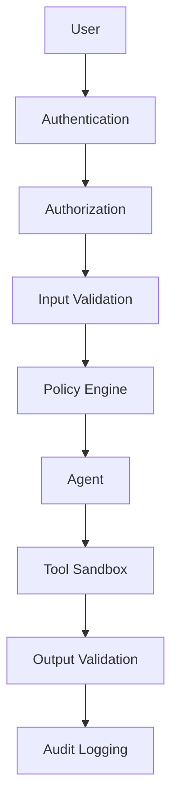

# 11. Security

> Security protects AI systems, users, data, models, tools, and infrastructure from unauthorized access, misuse, attacks, and unintended behavior.

---

# Introduction

Security is a foundational requirement for production AI systems. As agents gain access to tools, APIs, memory, and external services, the potential impact of security failures increases significantly.

Security should be designed into the system from the beginning rather than added after deployment.

---

# Security Objectives

The primary objectives are:

- Confidentiality
- Integrity
- Availability
- Accountability
- Non-repudiation
- Least privilege

---

# Threat Model

Common threats include:

- Prompt injection
- Indirect prompt injection
- Data exfiltration
- Credential theft
- Tool abuse
- Model abuse
- Supply-chain attacks
- Denial of service
- Jailbreak attempts
- Unauthorized memory access

---

# Defense in Depth

---

# Authentication

Verify the identity of users, services, and agents before granting access.

Methods include:

- API keys
- OAuth
- SSO
- MFA
- Service accounts

---

# Authorization

Use Role-Based Access Control (RBAC) or Attribute-Based Access Control (ABAC).

Grant only the minimum permissions required.

---

# Secret Management

Never hard-code secrets.

Use:

- Secret managers
- Environment variables
- Key rotation
- Short-lived credentials

---

# Data Security

Protect:

- User prompts
- Retrieved documents
- Memory
- Embeddings
- Logs
- Training data

Encrypt sensitive data both in transit and at rest.

---

# Tool Security

- Validate tool inputs.
- Restrict available tools.
- Require approval for destructive actions.
- Log all tool calls.

---

# Memory Security

Control which agents may:

- read memory
- write memory
- update memory
- delete memory

---

# Network Security

Implement:

- TLS
- Private networks
- Firewalls
- API gateways
- Rate limiting

---

# Monitoring and Auditing

Record:

- authentication events
- authorization failures
- tool usage
- policy violations
- configuration changes

---

# Incident Response

1. Detect
2. Contain
3. Eradicate
4. Recover
5. Review
6. Improve

---

# Failure Modes

| Failure | Mitigation |
|---|---|
| Hard-coded secrets | Secret manager |
| Excessive permissions | Least privilege |
| Prompt injection | Input validation |
| Data leakage | Output filtering |
| Missing audit logs | Structured logging |

---

# Anti-Patterns

- Shared administrator accounts
- Every agent has every permission
- Secrets in source control
- Trusting external content
- No security testing
- No incident response plan

---

# Design Principles

- Defense in depth
- Least privilege
- Secure defaults
- Explicit trust boundaries
- Continuous monitoring
- Regular security reviews

---

# Security Checklist

- [ ] Authentication
- [ ] Authorization
- [ ] Secret management
- [ ] Encryption
- [ ] Input validation
- [ ] Output validation
- [ ] Tool restrictions
- [ ] Audit logging
- [ ] Monitoring
- [ ] Incident response

---

# Related Chapters

- 04_tools.md
- 05_routing.md
- 07_guardrails.md
- 09_evaluation.md
- 10_monitoring.md

---

# Key Takeaways

Security is an ongoing engineering discipline that combines technical controls, operational processes, monitoring, and continuous improvement to protect AI systems throughout their lifecycle.

## Security Scenario 1

This scenario evaluates authentication, authorization, prompt validation, tool permissions, memory access, network protections, audit logging, and incident detection. Record security events, investigate anomalies, verify compliance with organizational policies, and continuously improve defenses based on observed threats.

## Security Scenario 2

This scenario evaluates authentication, authorization, prompt validation, tool permissions, memory access, network protections, audit logging, and incident detection. Record security events, investigate anomalies, verify compliance with organizational policies, and continuously improve defenses based on observed threats.

## Security Scenario 3

This scenario evaluates authentication, authorization, prompt validation, tool permissions, memory access, network protections, audit logging, and incident detection. Record security events, investigate anomalies, verify compliance with organizational policies, and continuously improve defenses based on observed threats.

## Security Scenario 4

This scenario evaluates authentication, authorization, prompt validation, tool permissions, memory access, network protections, audit logging, and incident detection. Record security events, investigate anomalies, verify compliance with organizational policies, and continuously improve defenses based on observed threats.

## Security Scenario 5

This scenario evaluates authentication, authorization, prompt validation, tool permissions, memory access, network protections, audit logging, and incident detection. Record security events, investigate anomalies, verify compliance with organizational policies, and continuously improve defenses based on observed threats.

## Security Scenario 6

This scenario evaluates authentication, authorization, prompt validation, tool permissions, memory access, network protections, audit logging, and incident detection. Record security events, investigate anomalies, verify compliance with organizational policies, and continuously improve defenses based on observed threats.

## Security Scenario 7

This scenario evaluates authentication, authorization, prompt validation, tool permissions, memory access, network protections, audit logging, and incident detection. Record security events, investigate anomalies, verify compliance with organizational policies, and continuously improve defenses based on observed threats.

## Security Scenario 8

This scenario evaluates authentication, authorization, prompt validation, tool permissions, memory access, network protections, audit logging, and incident detection. Record security events, investigate anomalies, verify compliance with organizational policies, and continuously improve defenses based on observed threats.

## Security Scenario 9

This scenario evaluates authentication, authorization, prompt validation, tool permissions, memory access, network protections, audit logging, and incident detection. Record security events, investigate anomalies, verify compliance with organizational policies, and continuously improve defenses based on observed threats.

## Security Scenario 10

This scenario evaluates authentication, authorization, prompt validation, tool permissions, memory access, network protections, audit logging, and incident detection. Record security events, investigate anomalies, verify compliance with organizational policies, and continuously improve defenses based on observed threats.

## Security Scenario 11

This scenario evaluates authentication, authorization, prompt validation, tool permissions, memory access, network protections, audit logging, and incident detection. Record security events, investigate anomalies, verify compliance with organizational policies, and continuously improve defenses based on observed threats.

## Security Scenario 12

This scenario evaluates authentication, authorization, prompt validation, tool permissions, memory access, network protections, audit logging, and incident detection. Record security events, investigate anomalies, verify compliance with organizational policies, and continuously improve defenses based on observed threats.

## Security Scenario 13

This scenario evaluates authentication, authorization, prompt validation, tool permissions, memory access, network protections, audit logging, and incident detection. Record security events, investigate anomalies, verify compliance with organizational policies, and continuously improve defenses based on observed threats.

## Security Scenario 14

This scenario evaluates authentication, authorization, prompt validation, tool permissions, memory access, network protections, audit logging, and incident detection. Record security events, investigate anomalies, verify compliance with organizational policies, and continuously improve defenses based on observed threats.

## Security Scenario 15

This scenario evaluates authentication, authorization, prompt validation, tool permissions, memory access, network protections, audit logging, and incident detection. Record security events, investigate anomalies, verify compliance with organizational policies, and continuously improve defenses based on observed threats.

## Security Scenario 16

This scenario evaluates authentication, authorization, prompt validation, tool permissions, memory access, network protections, audit logging, and incident detection. Record security events, investigate anomalies, verify compliance with organizational policies, and continuously improve defenses based on observed threats.

## Security Scenario 17

This scenario evaluates authentication, authorization, prompt validation, tool permissions, memory access, network protections, audit logging, and incident detection. Record security events, investigate anomalies, verify compliance with organizational policies, and continuously improve defenses based on observed threats.

## Security Scenario 18

This scenario evaluates authentication, authorization, prompt validation, tool permissions, memory access, network protections, audit logging, and incident detection. Record security events, investigate anomalies, verify compliance with organizational policies, and continuously improve defenses based on observed threats.

## Security Scenario 19

This scenario evaluates authentication, authorization, prompt validation, tool permissions, memory access, network protections, audit logging, and incident detection. Record security events, investigate anomalies, verify compliance with organizational policies, and continuously improve defenses based on observed threats.

## Security Scenario 20

This scenario evaluates authentication, authorization, prompt validation, tool permissions, memory access, network protections, audit logging, and incident detection. Record security events, investigate anomalies, verify compliance with organizational policies, and continuously improve defenses based on observed threats.

## Security Scenario 21

This scenario evaluates authentication, authorization, prompt validation, tool permissions, memory access, network protections, audit logging, and incident detection. Record security events, investigate anomalies, verify compliance with organizational policies, and continuously improve defenses based on observed threats.

## Security Scenario 22

This scenario evaluates authentication, authorization, prompt validation, tool permissions, memory access, network protections, audit logging, and incident detection. Record security events, investigate anomalies, verify compliance with organizational policies, and continuously improve defenses based on observed threats.

## Security Scenario 23

This scenario evaluates authentication, authorization, prompt validation, tool permissions, memory access, network protections, audit logging, and incident detection. Record security events, investigate anomalies, verify compliance with organizational policies, and continuously improve defenses based on observed threats.

## Security Scenario 24

This scenario evaluates authentication, authorization, prompt validation, tool permissions, memory access, network protections, audit logging, and incident detection. Record security events, investigate anomalies, verify compliance with organizational policies, and continuously improve defenses based on observed threats.

## Security Scenario 25

This scenario evaluates authentication, authorization, prompt validation, tool permissions, memory access, network protections, audit logging, and incident detection. Record security events, investigate anomalies, verify compliance with organizational policies, and continuously improve defenses based on observed threats.

## Security Scenario 26

This scenario evaluates authentication, authorization, prompt validation, tool permissions, memory access, network protections, audit logging, and incident detection. Record security events, investigate anomalies, verify compliance with organizational policies, and continuously improve defenses based on observed threats.

## Security Scenario 27

This scenario evaluates authentication, authorization, prompt validation, tool permissions, memory access, network protections, audit logging, and incident detection. Record security events, investigate anomalies, verify compliance with organizational policies, and continuously improve defenses based on observed threats.

## Security Scenario 28

This scenario evaluates authentication, authorization, prompt validation, tool permissions, memory access, network protections, audit logging, and incident detection. Record security events, investigate anomalies, verify compliance with organizational policies, and continuously improve defenses based on observed threats.

## Security Scenario 29

This scenario evaluates authentication, authorization, prompt validation, tool permissions, memory access, network protections, audit logging, and incident detection. Record security events, investigate anomalies, verify compliance with organizational policies, and continuously improve defenses based on observed threats.

## Security Scenario 30

This scenario evaluates authentication, authorization, prompt validation, tool permissions, memory access, network protections, audit logging, and incident detection. Record security events, investigate anomalies, verify compliance with organizational policies, and continuously improve defenses based on observed threats.

## Security Scenario 31

This scenario evaluates authentication, authorization, prompt validation, tool permissions, memory access, network protections, audit logging, and incident detection. Record security events, investigate anomalies, verify compliance with organizational policies, and continuously improve defenses based on observed threats.

## Security Scenario 32

This scenario evaluates authentication, authorization, prompt validation, tool permissions, memory access, network protections, audit logging, and incident detection. Record security events, investigate anomalies, verify compliance with organizational policies, and continuously improve defenses based on observed threats.

## Security Scenario 33

This scenario evaluates authentication, authorization, prompt validation, tool permissions, memory access, network protections, audit logging, and incident detection. Record security events, investigate anomalies, verify compliance with organizational policies, and continuously improve defenses based on observed threats.

## Security Scenario 34

This scenario evaluates authentication, authorization, prompt validation, tool permissions, memory access, network protections, audit logging, and incident detection. Record security events, investigate anomalies, verify compliance with organizational policies, and continuously improve defenses based on observed threats.

## Security Scenario 35

This scenario evaluates authentication, authorization, prompt validation, tool permissions, memory access, network protections, audit logging, and incident detection. Record security events, investigate anomalies, verify compliance with organizational policies, and continuously improve defenses based on observed threats.

## Security Scenario 36

This scenario evaluates authentication, authorization, prompt validation, tool permissions, memory access, network protections, audit logging, and incident detection. Record security events, investigate anomalies, verify compliance with organizational policies, and continuously improve defenses based on observed threats.

## Security Scenario 37

This scenario evaluates authentication, authorization, prompt validation, tool permissions, memory access, network protections, audit logging, and incident detection. Record security events, investigate anomalies, verify compliance with organizational policies, and continuously improve defenses based on observed threats.

## Security Scenario 38

This scenario evaluates authentication, authorization, prompt validation, tool permissions, memory access, network protections, audit logging, and incident detection. Record security events, investigate anomalies, verify compliance with organizational policies, and continuously improve defenses based on observed threats.

## Security Scenario 39

This scenario evaluates authentication, authorization, prompt validation, tool permissions, memory access, network protections, audit logging, and incident detection. Record security events, investigate anomalies, verify compliance with organizational policies, and continuously improve defenses based on observed threats.

## Security Scenario 40

This scenario evaluates authentication, authorization, prompt validation, tool permissions, memory access, network protections, audit logging, and incident detection. Record security events, investigate anomalies, verify compliance with organizational policies, and continuously improve defenses based on observed threats.

## Security Scenario 41

This scenario evaluates authentication, authorization, prompt validation, tool permissions, memory access, network protections, audit logging, and incident detection. Record security events, investigate anomalies, verify compliance with organizational policies, and continuously improve defenses based on observed threats.

## Security Scenario 42

This scenario evaluates authentication, authorization, prompt validation, tool permissions, memory access, network protections, audit logging, and incident detection. Record security events, investigate anomalies, verify compliance with organizational policies, and continuously improve defenses based on observed threats.

## Security Scenario 43

This scenario evaluates authentication, authorization, prompt validation, tool permissions, memory access, network protections, audit logging, and incident detection. Record security events, investigate anomalies, verify compliance with organizational policies, and continuously improve defenses based on observed threats.

## Security Scenario 44

This scenario evaluates authentication, authorization, prompt validation, tool permissions, memory access, network protections, audit logging, and incident detection. Record security events, investigate anomalies, verify compliance with organizational policies, and continuously improve defenses based on observed threats.

## Security Scenario 45

This scenario evaluates authentication, authorization, prompt validation, tool permissions, memory access, network protections, audit logging, and incident detection. Record security events, investigate anomalies, verify compliance with organizational policies, and continuously improve defenses based on observed threats.

## Security Scenario 46

This scenario evaluates authentication, authorization, prompt validation, tool permissions, memory access, network protections, audit logging, and incident detection. Record security events, investigate anomalies, verify compliance with organizational policies, and continuously improve defenses based on observed threats.

## Security Scenario 47

This scenario evaluates authentication, authorization, prompt validation, tool permissions, memory access, network protections, audit logging, and incident detection. Record security events, investigate anomalies, verify compliance with organizational policies, and continuously improve defenses based on observed threats.

## Security Scenario 48

This scenario evaluates authentication, authorization, prompt validation, tool permissions, memory access, network protections, audit logging, and incident detection. Record security events, investigate anomalies, verify compliance with organizational policies, and continuously improve defenses based on observed threats.

## Security Scenario 49

This scenario evaluates authentication, authorization, prompt validation, tool permissions, memory access, network protections, audit logging, and incident detection. Record security events, investigate anomalies, verify compliance with organizational policies, and continuously improve defenses based on observed threats.

## Security Scenario 50

This scenario evaluates authentication, authorization, prompt validation, tool permissions, memory access, network protections, audit logging, and incident detection. Record security events, investigate anomalies, verify compliance with organizational policies, and continuously improve defenses based on observed threats.

## Security Scenario 51

This scenario evaluates authentication, authorization, prompt validation, tool permissions, memory access, network protections, audit logging, and incident detection. Record security events, investigate anomalies, verify compliance with organizational policies, and continuously improve defenses based on observed threats.

## Security Scenario 52

This scenario evaluates authentication, authorization, prompt validation, tool permissions, memory access, network protections, audit logging, and incident detection. Record security events, investigate anomalies, verify compliance with organizational policies, and continuously improve defenses based on observed threats.

## Security Scenario 53

This scenario evaluates authentication, authorization, prompt validation, tool permissions, memory access, network protections, audit logging, and incident detection. Record security events, investigate anomalies, verify compliance with organizational policies, and continuously improve defenses based on observed threats.

## Security Scenario 54

This scenario evaluates authentication, authorization, prompt validation, tool permissions, memory access, network protections, audit logging, and incident detection. Record security events, investigate anomalies, verify compliance with organizational policies, and continuously improve defenses based on observed threats.

## Security Scenario 55

This scenario evaluates authentication, authorization, prompt validation, tool permissions, memory access, network protections, audit logging, and incident detection. Record security events, investigate anomalies, verify compliance with organizational policies, and continuously improve defenses based on observed threats.

## Security Scenario 56

This scenario evaluates authentication, authorization, prompt validation, tool permissions, memory access, network protections, audit logging, and incident detection. Record security events, investigate anomalies, verify compliance with organizational policies, and continuously improve defenses based on observed threats.

## Security Scenario 57

This scenario evaluates authentication, authorization, prompt validation, tool permissions, memory access, network protections, audit logging, and incident detection. Record security events, investigate anomalies, verify compliance with organizational policies, and continuously improve defenses based on observed threats.

## Security Scenario 58

This scenario evaluates authentication, authorization, prompt validation, tool permissions, memory access, network protections, audit logging, and incident detection. Record security events, investigate anomalies, verify compliance with organizational policies, and continuously improve defenses based on observed threats.

## Security Scenario 59

This scenario evaluates authentication, authorization, prompt validation, tool permissions, memory access, network protections, audit logging, and incident detection. Record security events, investigate anomalies, verify compliance with organizational policies, and continuously improve defenses based on observed threats.

## Security Scenario 60

This scenario evaluates authentication, authorization, prompt validation, tool permissions, memory access, network protections, audit logging, and incident detection. Record security events, investigate anomalies, verify compliance with organizational policies, and continuously improve defenses based on observed threats.

## Security Scenario 61

This scenario evaluates authentication, authorization, prompt validation, tool permissions, memory access, network protections, audit logging, and incident detection. Record security events, investigate anomalies, verify compliance with organizational policies, and continuously improve defenses based on observed threats.

## Security Scenario 62

This scenario evaluates authentication, authorization, prompt validation, tool permissions, memory access, network protections, audit logging, and incident detection. Record security events, investigate anomalies, verify compliance with organizational policies, and continuously improve defenses based on observed threats.

## Security Scenario 63

This scenario evaluates authentication, authorization, prompt validation, tool permissions, memory access, network protections, audit logging, and incident detection. Record security events, investigate anomalies, verify compliance with organizational policies, and continuously improve defenses based on observed threats.

## Security Scenario 64

This scenario evaluates authentication, authorization, prompt validation, tool permissions, memory access, network protections, audit logging, and incident detection. Record security events, investigate anomalies, verify compliance with organizational policies, and continuously improve defenses based on observed threats.

## Security Scenario 65

This scenario evaluates authentication, authorization, prompt validation, tool permissions, memory access, network protections, audit logging, and incident detection. Record security events, investigate anomalies, verify compliance with organizational policies, and continuously improve defenses based on observed threats.

## Security Scenario 66

This scenario evaluates authentication, authorization, prompt validation, tool permissions, memory access, network protections, audit logging, and incident detection. Record security events, investigate anomalies, verify compliance with organizational policies, and continuously improve defenses based on observed threats.

## Security Scenario 67

This scenario evaluates authentication, authorization, prompt validation, tool permissions, memory access, network protections, audit logging, and incident detection. Record security events, investigate anomalies, verify compliance with organizational policies, and continuously improve defenses based on observed threats.

## Security Scenario 68

This scenario evaluates authentication, authorization, prompt validation, tool permissions, memory access, network protections, audit logging, and incident detection. Record security events, investigate anomalies, verify compliance with organizational policies, and continuously improve defenses based on observed threats.

## Security Scenario 69

This scenario evaluates authentication, authorization, prompt validation, tool permissions, memory access, network protections, audit logging, and incident detection. Record security events, investigate anomalies, verify compliance with organizational policies, and continuously improve defenses based on observed threats.

## Security Scenario 70

This scenario evaluates authentication, authorization, prompt validation, tool permissions, memory access, network protections, audit logging, and incident detection. Record security events, investigate anomalies, verify compliance with organizational policies, and continuously improve defenses based on observed threats.

## Security Scenario 71

This scenario evaluates authentication, authorization, prompt validation, tool permissions, memory access, network protections, audit logging, and incident detection. Record security events, investigate anomalies, verify compliance with organizational policies, and continuously improve defenses based on observed threats.

## Security Scenario 72

This scenario evaluates authentication, authorization, prompt validation, tool permissions, memory access, network protections, audit logging, and incident detection. Record security events, investigate anomalies, verify compliance with organizational policies, and continuously improve defenses based on observed threats.

## Security Scenario 73

This scenario evaluates authentication, authorization, prompt validation, tool permissions, memory access, network protections, audit logging, and incident detection. Record security events, investigate anomalies, verify compliance with organizational policies, and continuously improve defenses based on observed threats.

## Security Scenario 74

This scenario evaluates authentication, authorization, prompt validation, tool permissions, memory access, network protections, audit logging, and incident detection. Record security events, investigate anomalies, verify compliance with organizational policies, and continuously improve defenses based on observed threats.

## Security Scenario 75

This scenario evaluates authentication, authorization, prompt validation, tool permissions, memory access, network protections, audit logging, and incident detection. Record security events, investigate anomalies, verify compliance with organizational policies, and continuously improve defenses based on observed threats.

## Security Scenario 76

This scenario evaluates authentication, authorization, prompt validation, tool permissions, memory access, network protections, audit logging, and incident detection. Record security events, investigate anomalies, verify compliance with organizational policies, and continuously improve defenses based on observed threats.

## Security Scenario 77

This scenario evaluates authentication, authorization, prompt validation, tool permissions, memory access, network protections, audit logging, and incident detection. Record security events, investigate anomalies, verify compliance with organizational policies, and continuously improve defenses based on observed threats.

## Security Scenario 78

This scenario evaluates authentication, authorization, prompt validation, tool permissions, memory access, network protections, audit logging, and incident detection. Record security events, investigate anomalies, verify compliance with organizational policies, and continuously improve defenses based on observed threats.

## Security Scenario 79

This scenario evaluates authentication, authorization, prompt validation, tool permissions, memory access, network protections, audit logging, and incident detection. Record security events, investigate anomalies, verify compliance with organizational policies, and continuously improve defenses based on observed threats.

## Security Scenario 80

This scenario evaluates authentication, authorization, prompt validation, tool permissions, memory access, network protections, audit logging, and incident detection. Record security events, investigate anomalies, verify compliance with organizational policies, and continuously improve defenses based on observed threats.

## Security Scenario 81

This scenario evaluates authentication, authorization, prompt validation, tool permissions, memory access, network protections, audit logging, and incident detection. Record security events, investigate anomalies, verify compliance with organizational policies, and continuously improve defenses based on observed threats.

## Security Scenario 82

This scenario evaluates authentication, authorization, prompt validation, tool permissions, memory access, network protections, audit logging, and incident detection. Record security events, investigate anomalies, verify compliance with organizational policies, and continuously improve defenses based on observed threats.

## Security Scenario 83

This scenario evaluates authentication, authorization, prompt validation, tool permissions, memory access, network protections, audit logging, and incident detection. Record security events, investigate anomalies, verify compliance with organizational policies, and continuously improve defenses based on observed threats.

## Security Scenario 84

This scenario evaluates authentication, authorization, prompt validation, tool permissions, memory access, network protections, audit logging, and incident detection. Record security events, investigate anomalies, verify compliance with organizational policies, and continuously improve defenses based on observed threats.

## Security Scenario 85

This scenario evaluates authentication, authorization, prompt validation, tool permissions, memory access, network protections, audit logging, and incident detection. Record security events, investigate anomalies, verify compliance with organizational policies, and continuously improve defenses based on observed threats.

## Security Scenario 86

This scenario evaluates authentication, authorization, prompt validation, tool permissions, memory access, network protections, audit logging, and incident detection. Record security events, investigate anomalies, verify compliance with organizational policies, and continuously improve defenses based on observed threats.

## Security Scenario 87

This scenario evaluates authentication, authorization, prompt validation, tool permissions, memory access, network protections, audit logging, and incident detection. Record security events, investigate anomalies, verify compliance with organizational policies, and continuously improve defenses based on observed threats.

## Security Scenario 88

This scenario evaluates authentication, authorization, prompt validation, tool permissions, memory access, network protections, audit logging, and incident detection. Record security events, investigate anomalies, verify compliance with organizational policies, and continuously improve defenses based on observed threats.

## Security Scenario 89

This scenario evaluates authentication, authorization, prompt validation, tool permissions, memory access, network protections, audit logging, and incident detection. Record security events, investigate anomalies, verify compliance with organizational policies, and continuously improve defenses based on observed threats.

## Security Scenario 90

This scenario evaluates authentication, authorization, prompt validation, tool permissions, memory access, network protections, audit logging, and incident detection. Record security events, investigate anomalies, verify compliance with organizational policies, and continuously improve defenses based on observed threats.

## Security Scenario 91

This scenario evaluates authentication, authorization, prompt validation, tool permissions, memory access, network protections, audit logging, and incident detection. Record security events, investigate anomalies, verify compliance with organizational policies, and continuously improve defenses based on observed threats.

## Security Scenario 92

This scenario evaluates authentication, authorization, prompt validation, tool permissions, memory access, network protections, audit logging, and incident detection. Record security events, investigate anomalies, verify compliance with organizational policies, and continuously improve defenses based on observed threats.

## Security Scenario 93

This scenario evaluates authentication, authorization, prompt validation, tool permissions, memory access, network protections, audit logging, and incident detection. Record security events, investigate anomalies, verify compliance with organizational policies, and continuously improve defenses based on observed threats.

## Security Scenario 94

This scenario evaluates authentication, authorization, prompt validation, tool permissions, memory access, network protections, audit logging, and incident detection. Record security events, investigate anomalies, verify compliance with organizational policies, and continuously improve defenses based on observed threats.

## Security Scenario 95

This scenario evaluates authentication, authorization, prompt validation, tool permissions, memory access, network protections, audit logging, and incident detection. Record security events, investigate anomalies, verify compliance with organizational policies, and continuously improve defenses based on observed threats.

## Security Scenario 96

This scenario evaluates authentication, authorization, prompt validation, tool permissions, memory access, network protections, audit logging, and incident detection. Record security events, investigate anomalies, verify compliance with organizational policies, and continuously improve defenses based on observed threats.

## Security Scenario 97

This scenario evaluates authentication, authorization, prompt validation, tool permissions, memory access, network protections, audit logging, and incident detection. Record security events, investigate anomalies, verify compliance with organizational policies, and continuously improve defenses based on observed threats.

## Security Scenario 98

This scenario evaluates authentication, authorization, prompt validation, tool permissions, memory access, network protections, audit logging, and incident detection. Record security events, investigate anomalies, verify compliance with organizational policies, and continuously improve defenses based on observed threats.

## Security Scenario 99

This scenario evaluates authentication, authorization, prompt validation, tool permissions, memory access, network protections, audit logging, and incident detection. Record security events, investigate anomalies, verify compliance with organizational policies, and continuously improve defenses based on observed threats.

## Security Scenario 100

This scenario evaluates authentication, authorization, prompt validation, tool permissions, memory access, network protections, audit logging, and incident detection. Record security events, investigate anomalies, verify compliance with organizational policies, and continuously improve defenses based on observed threats.
