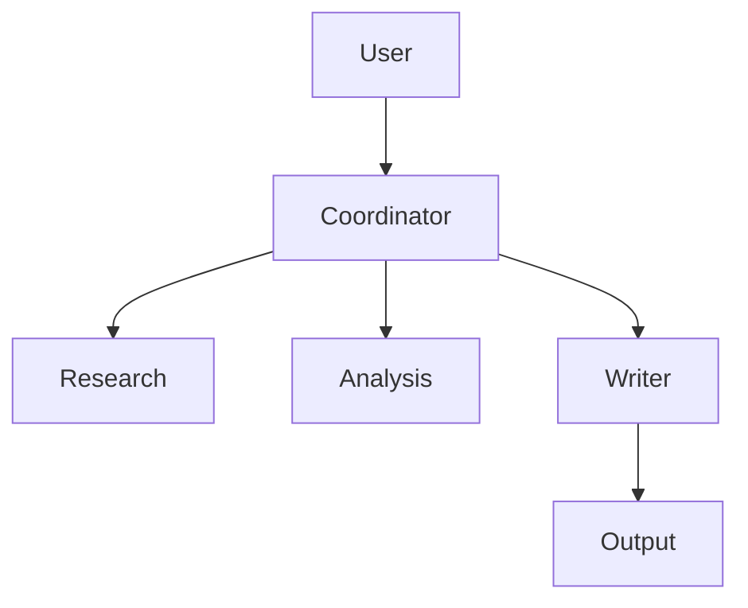

# 12. Multi-Agent Systems

> Multi-agent systems coordinate multiple specialized AI agents to solve complex problems more effectively than a single general-purpose agent.

---

# Introduction

Multi-agent systems divide work among specialized agents with clearly defined responsibilities. Rather than giving one agent every tool, prompt, and responsibility, a coordinator routes work to agents with focused expertise.

Typical roles include:

- Coordinator
- Planner
- Research Agent
- Coding Agent
- Reviewer
- Memory Manager
- Tool Executor
- Monitoring Agent

---

# Why Multi-Agent Systems Exist

A single agent eventually becomes difficult to scale and maintain.

Benefits of specialization include:

- simpler prompts
- smaller tool sets
- clearer permissions
- easier debugging
- independent scaling
- reusable components

---

# When to Use Multiple Agents

Use multi-agent systems when:

- tasks naturally divide into independent stages
- different permissions are required
- different models are optimal
- parallel execution improves latency
- independent review improves quality

Avoid them for simple workflows.

---

# Architectures

## Hub-and-Spoke

## Pipeline

## Peer-to-Peer

Agents communicate directly without a permanent coordinator.

---

# Communication

Best practices:

- structured messages
- versioned schemas
- explicit ownership
- bounded conversations
- timeout handling

---

# Shared vs Private Memory

Private memory belongs to one agent.

Shared memory stores artifacts needed across agents.

---

# Tool Ownership

Each agent should receive only the tools required for its responsibilities.

Follow the principle of least privilege.

---

# Coordination

Typical lifecycle:

1. Decompose task
2. Assign work
3. Execute in parallel where possible
4. Merge outputs
5. Resolve conflicts
6. Produce final answer

---

# Evaluation

Measure:

- task success
- latency
- cost
- communication overhead
- conflict rate
- retry rate
- human review rate

---

# Failure Modes

| Failure | Mitigation |
|---|---|
| Coordinator bottleneck | Hierarchical routing |
| Duplicate work | Better planning |
| Infinite conversations | Message limits |
| Conflicting answers | Reviewer agent |
| Tool misuse | Permission boundaries |

---

# Anti-Patterns

- God Coordinator
- Too Many Agents
- Hidden Shared State
- Endless Debate
- Overlapping Responsibilities
- Every Agent Has Every Tool

---

# Design Principles

- Specialize agents.
- Keep interfaces narrow.
- Minimize communication.
- Log interactions.
- Evaluate collaboration.
- Prefer simple systems first.

---

# Design Checklist

- [ ] Define responsibilities.
- [ ] Define message schemas.
- [ ] Assign tool ownership.
- [ ] Separate memory.
- [ ] Implement routing.
- [ ] Add monitoring.
- [ ] Test failures.
- [ ] Measure cost.

---

# Related Chapters

- 01_agents.md
- 02_workflows.md
- 03_memory.md
- 04_tools.md
- 05_routing.md
- 07_guardrails.md
- 09_evaluation.md
- 10_monitoring.md

---

# Key Takeaways

- Multi-agent systems improve modularity through specialization.
- Coordination is often more important than the agents themselves.
- Clear interfaces and permissions reduce complexity.
- Measure whether multiple agents actually outperform a simpler design.

## Example Scenario 1

A coordinator receives a request, decomposes it into subtasks, routes work to specialized agents, validates intermediate outputs, merges results, and produces the final response. This scenario illustrates how specialization, routing, shared memory, monitoring, and evaluation work together in production systems.

## Example Scenario 2

A coordinator receives a request, decomposes it into subtasks, routes work to specialized agents, validates intermediate outputs, merges results, and produces the final response. This scenario illustrates how specialization, routing, shared memory, monitoring, and evaluation work together in production systems.

## Example Scenario 3

A coordinator receives a request, decomposes it into subtasks, routes work to specialized agents, validates intermediate outputs, merges results, and produces the final response. This scenario illustrates how specialization, routing, shared memory, monitoring, and evaluation work together in production systems.

## Example Scenario 4

A coordinator receives a request, decomposes it into subtasks, routes work to specialized agents, validates intermediate outputs, merges results, and produces the final response. This scenario illustrates how specialization, routing, shared memory, monitoring, and evaluation work together in production systems.

## Example Scenario 5

A coordinator receives a request, decomposes it into subtasks, routes work to specialized agents, validates intermediate outputs, merges results, and produces the final response. This scenario illustrates how specialization, routing, shared memory, monitoring, and evaluation work together in production systems.

## Example Scenario 6

A coordinator receives a request, decomposes it into subtasks, routes work to specialized agents, validates intermediate outputs, merges results, and produces the final response. This scenario illustrates how specialization, routing, shared memory, monitoring, and evaluation work together in production systems.

## Example Scenario 7

A coordinator receives a request, decomposes it into subtasks, routes work to specialized agents, validates intermediate outputs, merges results, and produces the final response. This scenario illustrates how specialization, routing, shared memory, monitoring, and evaluation work together in production systems.

## Example Scenario 8

A coordinator receives a request, decomposes it into subtasks, routes work to specialized agents, validates intermediate outputs, merges results, and produces the final response. This scenario illustrates how specialization, routing, shared memory, monitoring, and evaluation work together in production systems.

## Example Scenario 9

A coordinator receives a request, decomposes it into subtasks, routes work to specialized agents, validates intermediate outputs, merges results, and produces the final response. This scenario illustrates how specialization, routing, shared memory, monitoring, and evaluation work together in production systems.

## Example Scenario 10

A coordinator receives a request, decomposes it into subtasks, routes work to specialized agents, validates intermediate outputs, merges results, and produces the final response. This scenario illustrates how specialization, routing, shared memory, monitoring, and evaluation work together in production systems.

## Example Scenario 11

A coordinator receives a request, decomposes it into subtasks, routes work to specialized agents, validates intermediate outputs, merges results, and produces the final response. This scenario illustrates how specialization, routing, shared memory, monitoring, and evaluation work together in production systems.

## Example Scenario 12

A coordinator receives a request, decomposes it into subtasks, routes work to specialized agents, validates intermediate outputs, merges results, and produces the final response. This scenario illustrates how specialization, routing, shared memory, monitoring, and evaluation work together in production systems.

## Example Scenario 13

A coordinator receives a request, decomposes it into subtasks, routes work to specialized agents, validates intermediate outputs, merges results, and produces the final response. This scenario illustrates how specialization, routing, shared memory, monitoring, and evaluation work together in production systems.

## Example Scenario 14

A coordinator receives a request, decomposes it into subtasks, routes work to specialized agents, validates intermediate outputs, merges results, and produces the final response. This scenario illustrates how specialization, routing, shared memory, monitoring, and evaluation work together in production systems.

## Example Scenario 15

A coordinator receives a request, decomposes it into subtasks, routes work to specialized agents, validates intermediate outputs, merges results, and produces the final response. This scenario illustrates how specialization, routing, shared memory, monitoring, and evaluation work together in production systems.

## Example Scenario 16

A coordinator receives a request, decomposes it into subtasks, routes work to specialized agents, validates intermediate outputs, merges results, and produces the final response. This scenario illustrates how specialization, routing, shared memory, monitoring, and evaluation work together in production systems.

## Example Scenario 17

A coordinator receives a request, decomposes it into subtasks, routes work to specialized agents, validates intermediate outputs, merges results, and produces the final response. This scenario illustrates how specialization, routing, shared memory, monitoring, and evaluation work together in production systems.

## Example Scenario 18

A coordinator receives a request, decomposes it into subtasks, routes work to specialized agents, validates intermediate outputs, merges results, and produces the final response. This scenario illustrates how specialization, routing, shared memory, monitoring, and evaluation work together in production systems.

## Example Scenario 19

A coordinator receives a request, decomposes it into subtasks, routes work to specialized agents, validates intermediate outputs, merges results, and produces the final response. This scenario illustrates how specialization, routing, shared memory, monitoring, and evaluation work together in production systems.

## Example Scenario 20

A coordinator receives a request, decomposes it into subtasks, routes work to specialized agents, validates intermediate outputs, merges results, and produces the final response. This scenario illustrates how specialization, routing, shared memory, monitoring, and evaluation work together in production systems.

## Example Scenario 21

A coordinator receives a request, decomposes it into subtasks, routes work to specialized agents, validates intermediate outputs, merges results, and produces the final response. This scenario illustrates how specialization, routing, shared memory, monitoring, and evaluation work together in production systems.

## Example Scenario 22

A coordinator receives a request, decomposes it into subtasks, routes work to specialized agents, validates intermediate outputs, merges results, and produces the final response. This scenario illustrates how specialization, routing, shared memory, monitoring, and evaluation work together in production systems.

## Example Scenario 23

A coordinator receives a request, decomposes it into subtasks, routes work to specialized agents, validates intermediate outputs, merges results, and produces the final response. This scenario illustrates how specialization, routing, shared memory, monitoring, and evaluation work together in production systems.

## Example Scenario 24

A coordinator receives a request, decomposes it into subtasks, routes work to specialized agents, validates intermediate outputs, merges results, and produces the final response. This scenario illustrates how specialization, routing, shared memory, monitoring, and evaluation work together in production systems.

## Example Scenario 25

A coordinator receives a request, decomposes it into subtasks, routes work to specialized agents, validates intermediate outputs, merges results, and produces the final response. This scenario illustrates how specialization, routing, shared memory, monitoring, and evaluation work together in production systems.

## Example Scenario 26

A coordinator receives a request, decomposes it into subtasks, routes work to specialized agents, validates intermediate outputs, merges results, and produces the final response. This scenario illustrates how specialization, routing, shared memory, monitoring, and evaluation work together in production systems.

## Example Scenario 27

A coordinator receives a request, decomposes it into subtasks, routes work to specialized agents, validates intermediate outputs, merges results, and produces the final response. This scenario illustrates how specialization, routing, shared memory, monitoring, and evaluation work together in production systems.

## Example Scenario 28

A coordinator receives a request, decomposes it into subtasks, routes work to specialized agents, validates intermediate outputs, merges results, and produces the final response. This scenario illustrates how specialization, routing, shared memory, monitoring, and evaluation work together in production systems.

## Example Scenario 29

A coordinator receives a request, decomposes it into subtasks, routes work to specialized agents, validates intermediate outputs, merges results, and produces the final response. This scenario illustrates how specialization, routing, shared memory, monitoring, and evaluation work together in production systems.

## Example Scenario 30

A coordinator receives a request, decomposes it into subtasks, routes work to specialized agents, validates intermediate outputs, merges results, and produces the final response. This scenario illustrates how specialization, routing, shared memory, monitoring, and evaluation work together in production systems.

## Example Scenario 31

A coordinator receives a request, decomposes it into subtasks, routes work to specialized agents, validates intermediate outputs, merges results, and produces the final response. This scenario illustrates how specialization, routing, shared memory, monitoring, and evaluation work together in production systems.

## Example Scenario 32

A coordinator receives a request, decomposes it into subtasks, routes work to specialized agents, validates intermediate outputs, merges results, and produces the final response. This scenario illustrates how specialization, routing, shared memory, monitoring, and evaluation work together in production systems.

## Example Scenario 33

A coordinator receives a request, decomposes it into subtasks, routes work to specialized agents, validates intermediate outputs, merges results, and produces the final response. This scenario illustrates how specialization, routing, shared memory, monitoring, and evaluation work together in production systems.

## Example Scenario 34

A coordinator receives a request, decomposes it into subtasks, routes work to specialized agents, validates intermediate outputs, merges results, and produces the final response. This scenario illustrates how specialization, routing, shared memory, monitoring, and evaluation work together in production systems.

## Example Scenario 35

A coordinator receives a request, decomposes it into subtasks, routes work to specialized agents, validates intermediate outputs, merges results, and produces the final response. This scenario illustrates how specialization, routing, shared memory, monitoring, and evaluation work together in production systems.

## Example Scenario 36

A coordinator receives a request, decomposes it into subtasks, routes work to specialized agents, validates intermediate outputs, merges results, and produces the final response. This scenario illustrates how specialization, routing, shared memory, monitoring, and evaluation work together in production systems.

## Example Scenario 37

A coordinator receives a request, decomposes it into subtasks, routes work to specialized agents, validates intermediate outputs, merges results, and produces the final response. This scenario illustrates how specialization, routing, shared memory, monitoring, and evaluation work together in production systems.

## Example Scenario 38

A coordinator receives a request, decomposes it into subtasks, routes work to specialized agents, validates intermediate outputs, merges results, and produces the final response. This scenario illustrates how specialization, routing, shared memory, monitoring, and evaluation work together in production systems.

## Example Scenario 39

A coordinator receives a request, decomposes it into subtasks, routes work to specialized agents, validates intermediate outputs, merges results, and produces the final response. This scenario illustrates how specialization, routing, shared memory, monitoring, and evaluation work together in production systems.

## Example Scenario 40

A coordinator receives a request, decomposes it into subtasks, routes work to specialized agents, validates intermediate outputs, merges results, and produces the final response. This scenario illustrates how specialization, routing, shared memory, monitoring, and evaluation work together in production systems.

## Example Scenario 41

A coordinator receives a request, decomposes it into subtasks, routes work to specialized agents, validates intermediate outputs, merges results, and produces the final response. This scenario illustrates how specialization, routing, shared memory, monitoring, and evaluation work together in production systems.

## Example Scenario 42

A coordinator receives a request, decomposes it into subtasks, routes work to specialized agents, validates intermediate outputs, merges results, and produces the final response. This scenario illustrates how specialization, routing, shared memory, monitoring, and evaluation work together in production systems.

## Example Scenario 43

A coordinator receives a request, decomposes it into subtasks, routes work to specialized agents, validates intermediate outputs, merges results, and produces the final response. This scenario illustrates how specialization, routing, shared memory, monitoring, and evaluation work together in production systems.

## Example Scenario 44

A coordinator receives a request, decomposes it into subtasks, routes work to specialized agents, validates intermediate outputs, merges results, and produces the final response. This scenario illustrates how specialization, routing, shared memory, monitoring, and evaluation work together in production systems.

## Example Scenario 45

A coordinator receives a request, decomposes it into subtasks, routes work to specialized agents, validates intermediate outputs, merges results, and produces the final response. This scenario illustrates how specialization, routing, shared memory, monitoring, and evaluation work together in production systems.

## Example Scenario 46

A coordinator receives a request, decomposes it into subtasks, routes work to specialized agents, validates intermediate outputs, merges results, and produces the final response. This scenario illustrates how specialization, routing, shared memory, monitoring, and evaluation work together in production systems.

## Example Scenario 47

A coordinator receives a request, decomposes it into subtasks, routes work to specialized agents, validates intermediate outputs, merges results, and produces the final response. This scenario illustrates how specialization, routing, shared memory, monitoring, and evaluation work together in production systems.

## Example Scenario 48

A coordinator receives a request, decomposes it into subtasks, routes work to specialized agents, validates intermediate outputs, merges results, and produces the final response. This scenario illustrates how specialization, routing, shared memory, monitoring, and evaluation work together in production systems.

## Example Scenario 49

A coordinator receives a request, decomposes it into subtasks, routes work to specialized agents, validates intermediate outputs, merges results, and produces the final response. This scenario illustrates how specialization, routing, shared memory, monitoring, and evaluation work together in production systems.

## Example Scenario 50

A coordinator receives a request, decomposes it into subtasks, routes work to specialized agents, validates intermediate outputs, merges results, and produces the final response. This scenario illustrates how specialization, routing, shared memory, monitoring, and evaluation work together in production systems.

## Example Scenario 51

A coordinator receives a request, decomposes it into subtasks, routes work to specialized agents, validates intermediate outputs, merges results, and produces the final response. This scenario illustrates how specialization, routing, shared memory, monitoring, and evaluation work together in production systems.

## Example Scenario 52

A coordinator receives a request, decomposes it into subtasks, routes work to specialized agents, validates intermediate outputs, merges results, and produces the final response. This scenario illustrates how specialization, routing, shared memory, monitoring, and evaluation work together in production systems.

## Example Scenario 53

A coordinator receives a request, decomposes it into subtasks, routes work to specialized agents, validates intermediate outputs, merges results, and produces the final response. This scenario illustrates how specialization, routing, shared memory, monitoring, and evaluation work together in production systems.

## Example Scenario 54

A coordinator receives a request, decomposes it into subtasks, routes work to specialized agents, validates intermediate outputs, merges results, and produces the final response. This scenario illustrates how specialization, routing, shared memory, monitoring, and evaluation work together in production systems.

## Example Scenario 55

A coordinator receives a request, decomposes it into subtasks, routes work to specialized agents, validates intermediate outputs, merges results, and produces the final response. This scenario illustrates how specialization, routing, shared memory, monitoring, and evaluation work together in production systems.

## Example Scenario 56

A coordinator receives a request, decomposes it into subtasks, routes work to specialized agents, validates intermediate outputs, merges results, and produces the final response. This scenario illustrates how specialization, routing, shared memory, monitoring, and evaluation work together in production systems.

## Example Scenario 57

A coordinator receives a request, decomposes it into subtasks, routes work to specialized agents, validates intermediate outputs, merges results, and produces the final response. This scenario illustrates how specialization, routing, shared memory, monitoring, and evaluation work together in production systems.

## Example Scenario 58

A coordinator receives a request, decomposes it into subtasks, routes work to specialized agents, validates intermediate outputs, merges results, and produces the final response. This scenario illustrates how specialization, routing, shared memory, monitoring, and evaluation work together in production systems.

## Example Scenario 59

A coordinator receives a request, decomposes it into subtasks, routes work to specialized agents, validates intermediate outputs, merges results, and produces the final response. This scenario illustrates how specialization, routing, shared memory, monitoring, and evaluation work together in production systems.

## Example Scenario 60

A coordinator receives a request, decomposes it into subtasks, routes work to specialized agents, validates intermediate outputs, merges results, and produces the final response. This scenario illustrates how specialization, routing, shared memory, monitoring, and evaluation work together in production systems.

## Example Scenario 61

A coordinator receives a request, decomposes it into subtasks, routes work to specialized agents, validates intermediate outputs, merges results, and produces the final response. This scenario illustrates how specialization, routing, shared memory, monitoring, and evaluation work together in production systems.

## Example Scenario 62

A coordinator receives a request, decomposes it into subtasks, routes work to specialized agents, validates intermediate outputs, merges results, and produces the final response. This scenario illustrates how specialization, routing, shared memory, monitoring, and evaluation work together in production systems.

## Example Scenario 63

A coordinator receives a request, decomposes it into subtasks, routes work to specialized agents, validates intermediate outputs, merges results, and produces the final response. This scenario illustrates how specialization, routing, shared memory, monitoring, and evaluation work together in production systems.

## Example Scenario 64

A coordinator receives a request, decomposes it into subtasks, routes work to specialized agents, validates intermediate outputs, merges results, and produces the final response. This scenario illustrates how specialization, routing, shared memory, monitoring, and evaluation work together in production systems.

## Example Scenario 65

A coordinator receives a request, decomposes it into subtasks, routes work to specialized agents, validates intermediate outputs, merges results, and produces the final response. This scenario illustrates how specialization, routing, shared memory, monitoring, and evaluation work together in production systems.

## Example Scenario 66

A coordinator receives a request, decomposes it into subtasks, routes work to specialized agents, validates intermediate outputs, merges results, and produces the final response. This scenario illustrates how specialization, routing, shared memory, monitoring, and evaluation work together in production systems.

## Example Scenario 67

A coordinator receives a request, decomposes it into subtasks, routes work to specialized agents, validates intermediate outputs, merges results, and produces the final response. This scenario illustrates how specialization, routing, shared memory, monitoring, and evaluation work together in production systems.

## Example Scenario 68

A coordinator receives a request, decomposes it into subtasks, routes work to specialized agents, validates intermediate outputs, merges results, and produces the final response. This scenario illustrates how specialization, routing, shared memory, monitoring, and evaluation work together in production systems.

## Example Scenario 69

A coordinator receives a request, decomposes it into subtasks, routes work to specialized agents, validates intermediate outputs, merges results, and produces the final response. This scenario illustrates how specialization, routing, shared memory, monitoring, and evaluation work together in production systems.

## Example Scenario 70

A coordinator receives a request, decomposes it into subtasks, routes work to specialized agents, validates intermediate outputs, merges results, and produces the final response. This scenario illustrates how specialization, routing, shared memory, monitoring, and evaluation work together in production systems.

## Example Scenario 71

A coordinator receives a request, decomposes it into subtasks, routes work to specialized agents, validates intermediate outputs, merges results, and produces the final response. This scenario illustrates how specialization, routing, shared memory, monitoring, and evaluation work together in production systems.

## Example Scenario 72

A coordinator receives a request, decomposes it into subtasks, routes work to specialized agents, validates intermediate outputs, merges results, and produces the final response. This scenario illustrates how specialization, routing, shared memory, monitoring, and evaluation work together in production systems.

## Example Scenario 73

A coordinator receives a request, decomposes it into subtasks, routes work to specialized agents, validates intermediate outputs, merges results, and produces the final response. This scenario illustrates how specialization, routing, shared memory, monitoring, and evaluation work together in production systems.

## Example Scenario 74

A coordinator receives a request, decomposes it into subtasks, routes work to specialized agents, validates intermediate outputs, merges results, and produces the final response. This scenario illustrates how specialization, routing, shared memory, monitoring, and evaluation work together in production systems.

## Example Scenario 75

A coordinator receives a request, decomposes it into subtasks, routes work to specialized agents, validates intermediate outputs, merges results, and produces the final response. This scenario illustrates how specialization, routing, shared memory, monitoring, and evaluation work together in production systems.

## Example Scenario 76

A coordinator receives a request, decomposes it into subtasks, routes work to specialized agents, validates intermediate outputs, merges results, and produces the final response. This scenario illustrates how specialization, routing, shared memory, monitoring, and evaluation work together in production systems.

## Example Scenario 77

A coordinator receives a request, decomposes it into subtasks, routes work to specialized agents, validates intermediate outputs, merges results, and produces the final response. This scenario illustrates how specialization, routing, shared memory, monitoring, and evaluation work together in production systems.

## Example Scenario 78

A coordinator receives a request, decomposes it into subtasks, routes work to specialized agents, validates intermediate outputs, merges results, and produces the final response. This scenario illustrates how specialization, routing, shared memory, monitoring, and evaluation work together in production systems.

## Example Scenario 79

A coordinator receives a request, decomposes it into subtasks, routes work to specialized agents, validates intermediate outputs, merges results, and produces the final response. This scenario illustrates how specialization, routing, shared memory, monitoring, and evaluation work together in production systems.

## Example Scenario 80

A coordinator receives a request, decomposes it into subtasks, routes work to specialized agents, validates intermediate outputs, merges results, and produces the final response. This scenario illustrates how specialization, routing, shared memory, monitoring, and evaluation work together in production systems.
